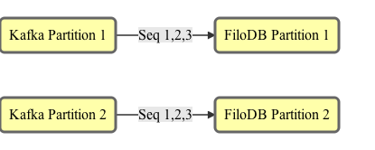
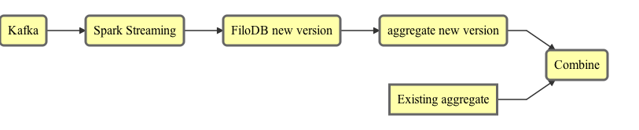
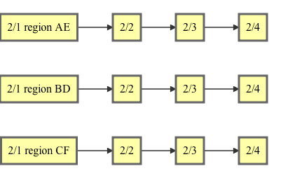
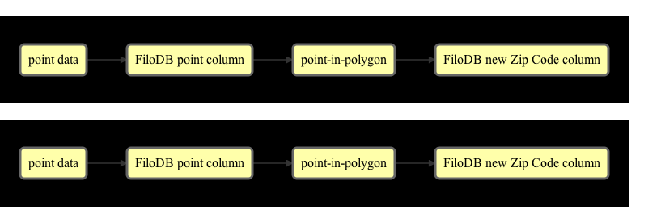
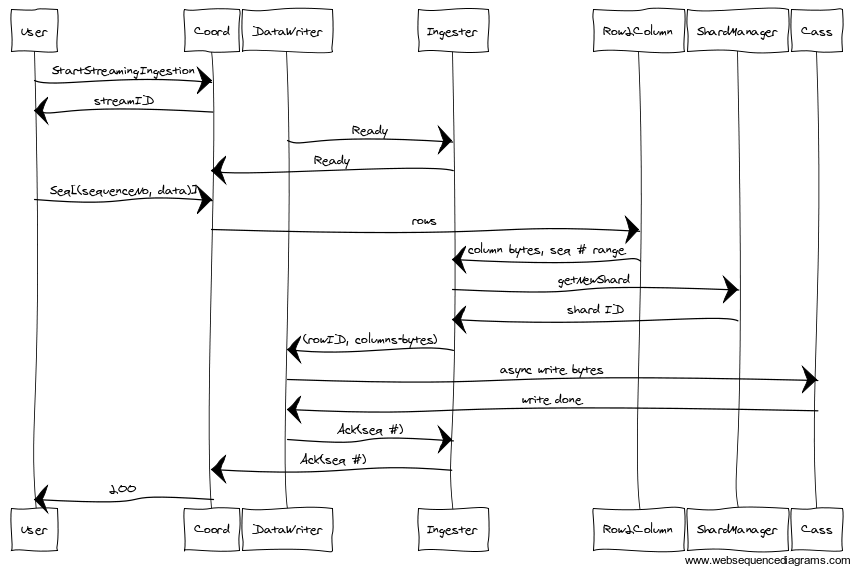

# Introduction to <span class="golden">FiloDB</span>

### Evan Chan

---

## What is <span class="golden">FiloDB</span>?

#### A Distributed, versioned, columnar database for tabular datasets
#### Based on Apache Cassandra and Apache Spark

---

## What's in the name?

<center>

</center>

Rich sweet layers of distributed, versioned database goodness

---

## Distributed

Apache Cassandra.  Scale out with no SPOF.  Cross-datacenter replication.

---

## Versioned

Incrementally add a column or a few rows as a new version.  Easily control what versions to query.  Roll back changes inexpensively.

Stream out new versions as continuous queries :)

---

## Columnar

- Parquet-style storage layout
- Retrieve select columns and minimize I/O for OLAP queries
- Add a new column without having to copy the whole table
- Vectorization and lazy/zero serialization for extreme efficiency

---

## Spark SQL Queries!

```sql
SELECT first, last, age FROM customers
  WHERE _version > 3 AND age < 40 LIMIT 100
```

---

## Think of <span class="golden">FiloDB</span> as
## Git + Parquet
## meets Cassandra and Spark

---

## A Database built for Streaming

- FiloDB is built for easy *exactly-once* ingestion from Kafka
- Stream process / query new versions continuously
- Back pressure designed in from the start

NOTE: Traditional databases are a poor match for modern streaming, incremental workloads.

---

## OLAP Performance without the Pain

- Really fast Spark SQL queries on Cassandra
    + No need to set up HDFS/Hadoop for analytical workloads
- Add new columns really cheaply.  Change the schema with new versions.
- Idempotent writes - no need for deduplication jobs in HDFS

---

## Performance: Cassandra

- Regular Cassandra table (CQL) reads vs FiloDB reads
- Study of different layouts of GDELT dataset on Cassandra 2.0.9
    + https://github.com/velvia/cassandra-gdelt
- Full table scan queries:
    + All columns: FiloDB is up to 90x faster
    + 1 out of 20 columns: FiloDB is up to 400x faster

---

## Performance: Cassandra and Spark

- Spark Cass Connector vs FiloDB Spark SQL
    + include Tachyon/caching study
- Parquet vs FiloDB

---

## Versioning - why it matters

- Databases: let's mutate one giant piece of state in place
    + **Basically hasn't changed since 1970's!**
- With Big Data and streaming, incremental processing is more and more important
- FiloDB is built on functional principles and lets you version and layer changes.  Add changes as new versions, don't mutate!
- Keep reading from older versions as changes are done to new versions

NOTE: Databases have largely remained the same - even more modern, in-memory ones.They are basically one monolithic piece of state.

---

## Versioning enables Streaming


<!-- .element: class="mermaid" -->

---

## Tight Spark Integration

* Read tables into Spark SQL, process, join, write back out as new tables or versions
* Easily integrate FiloDB with other sources - JSON, Avro, Parquet, Hive tables, etc.
* Use 1.2 Spark SQL data source API to selectively read only necessary columns
* Spark Streaming input and Spark Streaming processing of changes / new versions

---

## Wait, but I thought Cassandra was columnar?

- Cassandra/CQL groups values from each logical row together.  See [this explanation](http://www.slideshare.net/DataStax/understanding-how-cql3-maps-to-cassandras-internal-data-structure).
    + Reading a subset of columns still incurs high I/O cost
- FiloDB stores values from the same column together on disk, minimizing I/O for OLAP queries
- Initial studies show columnar layout is much more compact and 10-100x more efficient on reads
- FiloDB is designed for a virtually unlimited number of tables.  Cassandra will OOM with lots of CFs.

---

## What FiloDB is Optimized For

- Bulk appends and updates
- Ingesting a few datasets at a time in bulk
- OLAP / Data warehousing queries (full table scans)
- Generating views

---

## What FiloDB is Not Optimized For

- Pinpoint reads and writes
- OLTP

---

# <span class="golden">FiloDB</span> Use Cases

---

## FiloDB Concepts

- **Dataset**: a table with a schema
- **Version**: each "diff" or incremental set of changes (appends / updates / deletes / new column).  Maps well to new slices of data or annotating existing records with new columns.
- **Partition**: Divides and distributes the dataset. Allows parallel ingest.

---

## Use Case:
## Exactly-once ingestion from Kafka


<!-- .element: class="mermaid" -->

Replay of events from last ack + idempotent operations = exactly once writes

---

## Use Case: IoT / Incremental Streaming Traffic Analysis


<!-- .element: class="mermaid" -->

- Generating vehicle velocity vectors and proximity info on incremental slices
- Sliding window aggregation: add delta aggregation from latest version, subtract delta from earliest version in window

---

## Use Case: IoT


<!-- .element: class="mermaid" -->

- Again, partitions map to different geo regions
- Versions = time
- Makes geospatial queries efficient and easy
- To query by entity (eg vehicle), stream in another table partitioned by vehicle

---

## Use Case: Distributed Time-Series

- Partitions for parallel ingestion
- Versions for chunks of time
- Roll up oldest versions/time
- Compare performance to KairosDB

---

## Socrata Use Case: Public Dataset Versioning

- Versions correspond to periodic updates (appends, deletes)
    + Much cheaper than copying entire tables
    + Replace and deletes at row level not possible with Parquet
- Partitions used for parallel ingest of very large datasets

---

## Socrata Use Case: Geospatial Choropleths


<!-- .element: class="mermaid" -->

---

## Socrata Use Case: Geospatial Choropleths

- Want to aggregate big point data by different geo boundaries
- Partitions map to different geo regions
- Distributed geo-region coding 
    + Point (lat, long) -> Zip code polygon  (Spark SQL)
    + polygon IDs stored as new column, aggregated for choropleths
    + Additional region geometries cheaply added as new columns

---

## Use Case: Computed Columns and RDBMS-like DDL

On new version: compute column B from column A

DDL: Insert new version/column, column changed type.  Read from old version/type, transform to new version/type, write back. 

---

# <span class="golden">FiloDB</span> Deep Dive

---

## Assumptions and Tradeoffs

- Only one writer per partition.  Partitions are independent, like Kafka.
    + User decides how to partition data
    + Partitions can have varying size, rows numbered from 0 to N-1
    + Groups of rows converted into column chunks
    + A version/partition/row# uniquely identifies data within a dataset
- Each version is the unit of atomic change.  Changes within a version may not be atomic.
- Versions can be used for change isolation and propagation
    + No need for explicit transaction log.  Just read out data from a version

---

## Spark Notes

* Should be easy to cache columns in Tachyon using the Table support feature
* Implement custom `FiloColumnarRelation` that can efficiently scan ByteBuffers read from Cassandra.
    - Like `spark.sql.columnar.InMemoryRelation` but no need to recompress from source!  Should be much faster
    - Would be really interesting to compare with Parquet

---

## Cassandra Schema

This will probably change a lot.

--

## Datasets Table

```sql
CREATE TABLE datasets (
    name text,
    partitions list<text>,
    properties map<text, text>,
    PRIMARY KEY (name)
);
```

Dataset name must be globally unique.

--

## Columns Table

```sql
CREATE TABLE columns (
    dataset text,
    version int,
    column_name text,
    type text,
    deleted boolean,
    batch_size int,
    properties map<text, text>,
    PRIMARY KEY (dataset_name, version, column_name)
);
```

Combination of version and column_name uniquely identifies a column.

Dataset_name being partition key allows traversal of versions and columns.

--

## Partitions table

This is for tracking the shards within a partition.

```sql
CREATE TABLE partitions (
    dataset text,
    partition text,
    shardingStrategy text,
    firstRowId list<int>,
    firstVersion list<int>,
    versionBitMap list<blob>,
    PRIMARY KEY ((dataset, partition))
);
```

Partitions are internally sharded.  Different sharding strategies are available, but it is not a user-facing concern.  "bySize:<sizeInMB>" "byFixedNumRows:<numRows>"

--

## Partition-Lock table

Each partition has a lock to ensure only one writer per partition.  Cassandra's write-if-not-exists and LWT functionality along with a TTL is used.

```sql
CREATE TABLE partition-lock (
    dataset text,
    partition text,
    owner text,
    PRIMARY KEY ((dataset, partition))
);
```

The owner string should be globally unique, perhaps IP address and UUID.

--

## Data Table

```sql
CREATE TABLE data (
    dataset text,
    version int,
    partition text,
    firstRowId int,
    lastRowId int static,
    columns set<text> static,
    column_name text,
    row_id int,
    data blob
    PRIMARY KEY ((dataset, version, partition, firstRowId), column_name, row_id)
);
```

- A single partition shard consists of (partition, firstRowId)
- All the columns for a given shard of a partition are colocated together
- Works well for mostly-append data with few updates; data with many columns
- Works poorly when there are tons of updates on the same rows

--

## Data Table - Alternative Scheme

```sql
    PRIMARY KEY ((dataset, column_name, shard), row_id, version)
);
```

- All the versions are colocated, making merging trivial
- Works well for frequently updated data with not too many columns read at once
- Would work poorly for data with many columns;

---

## Example data: mostly appends

Chunk size of 100 rows

| Version | firstRow |    |    |     |     |
| :------ | :------- | -- | -- | --- | --- |
|  1      |  0       | Col1_R0 | Col1_R100 | Col2_R0 | Col2_R100 |
|  1      |  200     | Col1_R200 | Col1_R300 | Col2_R200 | Col2_R300 |
|  2      |  400     | Col1_R400 | Col1_R500 | Col2_R400 | Col2_R500 |
|  3      |  600     | Col1_R600 | Col1_R700 | Col2_R600 | Col2_R700 |
<!-- .element: class="fullwidth" -->

* Knowing the version and row ID allows one to find the row easily (though one has to get the partition to firstRow mapping)
* Row ID of each chunk is the first row number of the chunk

---

## Example Data: mostly updates

Chunk size of 100 rows

| Version | firstRow |    |    |     |     |
| :------ | :------- | -- | -- | --- | --- |
|  1      |  0       | Col1_R0 | Col1_R100 | Col2_R0 | Col2_R100 |
|  2      |  0       |         | Col1_R100' |    |  |
|  3      |  0       |         | Col1_R100'' |    |  |
|  4      |  0       |         | Col1_R100''' |    |  |

Reading Col1_R0 is easy.
Reading Col1_R100 is not.  We have to read all four versions to collapse into the latest version.

Also note that the chunk size determines the minimum size of data that is replaced.  Replacing one row within those 100 rows represents a read-modify-write cycle.

---

## Deep Dive - Ingestion

--

## Ingestion Goals

1. Don't lose any data!  Idempotent at-least-once
2. Backpressure.  Ingest only when ready.
3. Support distributed bulk ingest
4. Efficient ingest and efficient retries
5. Should work for streaming data, including error recovery

--

## Ingestion API

- User divides dataset into independent partitions, sequences input rows
- FiloDB internally shards partitions and tracks row IDs
- Row IDs numbered from 0 upwards, corresponds to partition input stream
- Row ID of each column chunk is the first row # of each chunk
- Append-only pattern: write to shard with highest starting row ID
- Regular acks of incoming stream

---

## From Rows to Columns

(TODO: Insert a diagram converting rows into column chunks, illustrating how within each partition data is addressed by row #)

--

## Typical Ingest Message Flow



--

## Don't Lose Any Data

- Increasing sequence numbers Kafka-style for each row/chunk of ingress stream
- Ack latest committed sequence number
    + Works for any data layout
    + Scalable, works when grouping rows into columnar layout
- Ingester logs state changes with every chunk
- On error:
    + Rewind to last committed sequence number (may rely on client for replay)
    + Ingester uses logged events to reconstruct prev state

---

## Versioning

- Query version n:  really accumulate all the state from version 0 to version n
- What if you could select a range of versions (n1, n2) to query?
    + Might have incomplete data.  It might contain only newly added columns for example, or newly added rows.
    + Over time, a range of old versions might get compacted, and rewritten.

---

## Version Control

Partitions must provide their own external synchronization mechanism to make sure they are all writing the same version.

---

## Versioning and Cassandra

* In the future, we could potentially use stored procedures (Cassandra 3.0) for
    - efficient reading of relevant versions (server side skipping of data)
    - help with compaction of versions
* HBase would be easier actually due to the built in versioning API

---

## Column Versioning

---

## Layered Architecture

Have a small core and layer functionality on top.  Keep the core extremely simple and reliable.

| Layer         |    Description    |
| :------------ | :---------------- |
| Core          | Basic I/O.  Version merging logic. No coordination of shards or versions.  No parsing of data. |
| Bulk Ingester | Coordinates parallel/distributed ingest of bulk and multiple datasets.  Coordinates sharding. |
| Vectorizer    | Groups multiple row values together for efficient I/O  |
| Spark         | All queries beyond basic data export; dataset joins    |
| Application   | Decides on versions, reads/writes data. |
<!-- .element: class="fullwidth" -->

---

## Primary keys

- Needed in some cases to look up a row by a user-defined key
- Recommend: optimize for bulk ingest/read, store primary key as just another column
- Add an inverted index mapping primary key to `(version, shard, row_id)`
    + Consider using Lucene integrations like StratioBD, Stargate (would need some customizations to work with this schema)
