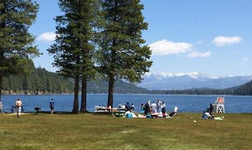
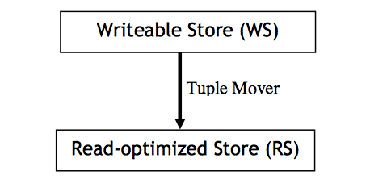
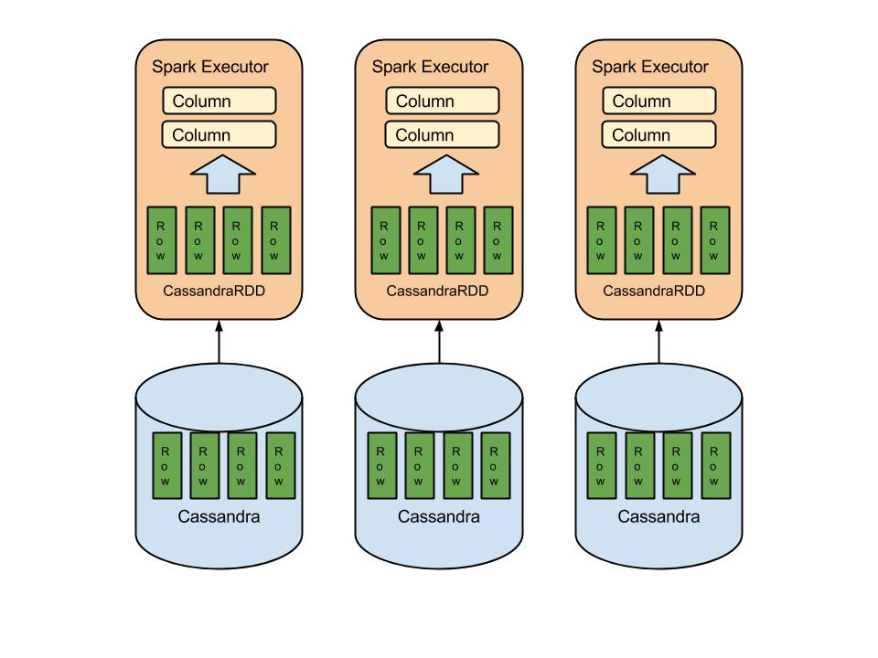
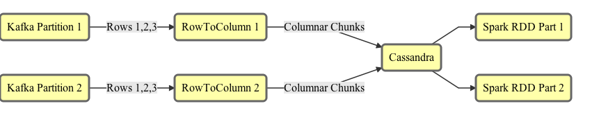
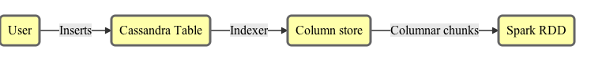

# Breakthrough OLAP Performance with
# <span class="cassred">Cassandra</span> and Spark

### Evan Chan
### August 2015

---

## Who am I?

<center>

</center>

- Distinguished Engineer, [TupleJump](http://www.tuplejump.com)
- @evanfchan
- [`http://velvia.github.io`](http://velvia.github.io)
- User and contributor to Spark since 0.9, Cassandra since 0.6
- Co-creator and maintainer of [Spark Job Server](http://github.com/spark-jobserver/spark-jobserver)

---

## About TupleJump

[TupleJump](http://tuplejump.com) is a big data technology leader providing solutions for rapid insights from data.

* [Calliope](http://tuplejump.github.io/calliope/) - the first Spark-Cassandra integration
* [Stargate](http://tuplejump.github.io/stargate/) - an open source Lucene indexer for Cassandra
* [SnackFS](https://github.com/tuplejump/snackfs) - open source HDFS for Cassandra

---

## Didn't I attend the same talk last year?

- Similar title, but mostly new material
- Will reveal new open source projects!  :)

---

## Problem Space

- Need analytical database / queries on structured big data
    + Something SQL-like, very flexible and fast
    + Pre-aggregation too limiting
- Fast data / constant updates
    + Ideally, want my queries to run over fresh data too

--

## Example: Video analytics

- Typical collection and analysis of consumer events
- 3 billion new events every day
- Video publishers want updated stats, the sooner the better
- Pre-aggregation only enables simple dashboard UIs
- What if one wants to offer more advanced analysis, or a generic data query API?
    + Eg, top countries filtered by device type, OS, browser

NOTE: Too many possible combinations to pre-aggregate

--

## Requirements

- Scalable - rules out PostGreSQL, etc.
- Easy to update and ingest new data
    + Not traditional OLAP cubes - that's not what I'm talking about
- Very fast for analytical queries - OLAP not OLTP
- Extremely flexible queries
- Preferably open source

---

## Parquet

- Widely used, lots of support (Spark, Impala, etc.)
- Problem: Parquet is read-optimized, not easy to use for writes
    + Cannot support idempotent writes
    + Optimized for writing very large chunks, not small updates
    + Not suitable for time series, IoT, etc.
    + Often needs multiple passes of jobs for compaction of small files, deduplication, etc.

&nbsp;
<p>
People really want a database-like abstraction, not a file format!

---

## Turns out this has been solved before!

<center>


</center>

Even [Facebook uses Vertica](http://www.vertica.com/?s=mpp+database).

--

## MPP Databases

<center>

</center>

- Easy writes plus fast queries, with constant transfers
- Automatic query optimization by storing intermediate query projections
- Stonebraker, et. al. - [CStore](https://cs.brown.edu/courses/cs227/archives/2008/mitchpapers/required4.pdf) paper (Brown Univ)

--

## What's wrong with MPP Databases?

- Closed source
- $$$
- Usually don't scale horizontally that well (or cost is prohibitive)

---

## <span class="cassred">Cassandra</span>

<center>

</center>

- Horizontally scalable
- Very flexible data modelling (lists, sets, custom data types)
- Easy to operate
- Perfect for ingestion of real time / machine data
- Best of breed storage technology, huge community
- **BUT: Simple queries only**
- **OLTP-oriented**

--

## Apache Spark

<center>

</center>

- Horizontally scalable, in-memory queries
- Functional Scala transforms - `map`, `filter`, `groupBy`, `sort` etc.
- SQL, machine learning, streaming, graph, R, many more plugins all on ONE platform - feed your SQL results to a logistic regression, easy!
- Huge number of connectors with every single storage technology

--

## Spark provides the missing fast, deep analytics piece of <span class="cassred">Cassandra</span>!

---

## Spark and <span class="cassred">Cassandra</span>
## OLAP Architectures

---

## Separate Storage and Query Layers

- Combine best of breed storage and query platforms
- Take full advantage of evolution of each
- Storage handles replication for availability
- Query can replicate data for scaling read concurrency - *independent!*

---

## Spark as Cassandra's Cache


--

## Spark SQL

- Appeared with Spark 1.0
- In-memory columnar store
- Parquet, Json, Cassandra connector, Avro, many more
- SQL as well as DataFrames (Pandas-style) API
- Indexing integrated into data sources (eg C* secondary indexes)
- Write custom functions in Scala ....  take that Hive UDFs!!
- Integrates well with MLBase, Scala/Java/Python

--

## Connecting Spark to Cassandra

- Datastax's [Spark Cassandra Connector](https://github.com/datastax/spark-cassandra-connector)
- TupleJump [Calliope](http://tuplejump.github.io/calliope/)

<p>&nbsp;
<center>
Get started in one line with `spark-shell`!
</center>

```bash
bin/spark-shell \
  --packages com.datastax.spark:spark-cassandra-connector_2.10:1.4.0-M3 \
  --conf spark.cassandra.connection.host=127.0.0.1
```

--

## Caching a SQL Table from Cassandra

DataFrames support in Cassandra Connector 1.4.0 (and 1.3.0):

<p>
```scala
val sqlContext = new org.apache.spark.sql.SQLContext(sc)

val df = sqlContext.read
                   .format("org.apache.spark.sql.cassandra")
                   .options(Map("table" -> "gdelt", "keyspace" -> "test"))
                   .load()
df.registerTempTable("gdelt")
sqlContext.cacheTable("gdelt")
sqlContext.sql("SELECT count(monthyear) FROM gdelt").show()
```

<p>&nbsp;<p>

- Spark does no caching by default - you will always be reading from C*!

--

## How Spark SQL's Table Caching Works



---

## Spark Cached Tables can be Really Fast

GDELT dataset, 4 million rows, 60 columns, localhost

| Method   |  secs       |
| :------- | ----------: |
| Uncached |   317       |
| Cached   |    0.38     |

<p>&nbsp;<p>
Almost a 1000x speedup!
<p>

On an 8-node EC2 c3.XL cluster, 117 million rows, can run common queries 1-2 seconds against cached dataset.

--

## Tuning Connector Partitioning

#### spark.cassandra.input.split.size

Guideline: One split per partition, one partition per CPU core

- Much more parallelism won't speed up job much, but will starve other C* requests

--

## Lesson #1: Take Advantage of Spark Caching!

---

## Problems with Cached Tables

- Still have to read the data from Cassandra first, which is slow
- Amount of RAM: your entire data + extra for conversion to cached table
- Cached tables only live in Spark executors - by default
    + tied to single context - not HA
    + once any executor dies, must re-read data from C*
- Caching takes time: convert from RDD[Row] to compressed columnar format
- Cannot easily combine new RDD[Row] with cached tables (and keep speed)

--

## Problems with Cached Tables

If you don't have enough RAM, Spark can cache your tables partly to disk.  This is still way, way, faster than scanning an entire C* table.  However, cached tables are still tied to a single Spark context/application.

Also: `rdd.cache()` is NOT the same as SQLContext's `cacheTable`!

--

## What about C* Secondary Indexing?

Spark-Cassandra Connector and Calliope can both reduce I/O by using Cassandra secondary indices.  Does this work with caching?

No, not really, because only the filtered rows would be cached.  Subsequent queries against this limited cached table would not give you expected results.

NOTE: the DataFrames support in connector 1.3.0-M1 doesn't seem to support predicate pushdown.

---

## Tachyon Off-Heap Caching


--

## Intro to Tachyon

- Tachyon: an in-memory cache for HDFS and other data sources
- Keeps data off-heap, so multiple Spark applications/executors can share data

--

## Wait, wait, wait!

What am I caching exactly?  Tachyon is designed for caching files or binary blobs.

- A serialized form of `CassandraRow/CassandraRDD`?
- Raw output from Cassandra driver?

Tachyon solves the HA problem, but not the I/O problem, and will involve writing tons of new code.

---

> Bad programmers worry about the code. Good programmers worry about data structures. <br>
  - Linus Torvalds

<p>&nbsp;<p>

Are we really thinking holistically about data modelling, caching, and how it affects the entire systems architecture?<!-- .element: class="fragment roll-in" -->

---

## Efficient Columnar Storage in Cassandra

### Wait, I thought Cassandra was columnar?

--

## How Cassandra stores your CQL Tables

Suppose you had this CQL table:

```sql
CREATE TABLE (
  department text,
  empId text,
  first text,
  last text,
  age int,
  PRIMARY KEY (department, empId)
);
```

--

## How Cassandra stores your CQL Tables

| PartitionKey | 01:first | 01:last | 01:age | 02:first | 02:last | 02:age |
| :----------- | :------- | :------ | -----: | :------- | :------ | -----: |
| Sales        | Bob      | Jones   | 34     | Susan    | O'Connor | 40    |
| Engineering  | Dilbert  | P       | ?      | Dogbert  | Dog     |  1     |

<p>&nbsp;<p>
Each row is stored contiguously.  All columns in row 2 come after row 1.

To analyze only age, C* still has to read every field.

--

Cassandra is really a row-based, OLTP-oriented datastore.

Unless you know how to use it otherwise  :)

NOTE: Cassandra is only columnar in the sense it permits wide rows, or clustering keys, but you'd be hard pressed to know that from looking at CQL table definitions.

---

> The traditional row-based data storage approach is dead<br>
  - Michael Stonebraker

--

## Columnar Storage (Memory)

**Name column**

| 0     |    1    |
| ----- | ------- |
| 0     |    1    |
<p>&nbsp;<p>
Dictionary: {0: "Barak", 1: "Hillary"}

<p>&nbsp;<p>
**Age column**

| 0     |    1    |
| ----- | ------- |
| 46 | 66 |

NOTE: data from each column is stored together.

--

## Columnar Storage (Cassandra)

Review: each physical row in Cassandra (e.g. a "partition key") stores its columns together on disk.

<p>&nbsp;<p>
Schema CF

| Rowkey    |  Type  |
| :-------- | :----- |
| Name      |  StringDict |
| Age       |  Int   |

<p>&nbsp;<p>
Data CF

| Rowkey    |  0 |  1 |
| :-------- | -- | -- |
| Name      | 0  |  1 |
| Age       | 46 | 66 |

--

## Columnar Format solves I/O

- Compression
    + Dictionary compression - HUGE savings for low-cardinality string columns
    + RLE, other techniques
- Reduce I/O
    + Only columns needed for query are loaded from disk
- Batch multiple rows in one cell for efficiency (avoid cluster key overhead)

--

## Columnar Format solves Caching

- Use the same format on disk, in cache, in memory scan
    + Caching works a lot better when the cached object is the same!!
- No data format dissonance means bringing in new bits of data and combining with existing cached data is seamless

---

## So, why isn't everybody doing this?

- No columnar storage format designed to work with NoSQL stores
- Efficient conversion to/from columnar format a hard problem
- Most infrastructure is still row oriented
    + Spark SQL/DataFrames based on `RDD[Row]`
    + Spark Catalyst is a row-oriented query parser

NOTE: Simply put, it's a lot of work!

---

> All hard work leads to profit, but mere talk leads to poverty.<br>
> - Proverbs 14:23

--


---

## Columnar Storage Performance Study

<p>&nbsp;</p>
<center>
http://github.com/velvia/cassandra-gdelt
</center>

--

## GDELT Dataset

- [Global Database of Events, Language, and Tone](http://gdeltproject.org)
    + 1979 to now
- 60 columns, 250 million+ rows, 250GB+
- Let's compare Cassandra I/O only, no caching or Spark

--

## The scenarios

1. Narrow table - CQL table with one row per partition key
2. Wide table - wide rows with 10,000 logical rows per partition key
3. Columnar layout - 1000 rows per columnar chunk, wide rows, with dictionary compression

First 4 million rows, localhost, SSD, C* 2.0.9, LZ4 compression.  Compaction performed before read benchmarks.

--

## Query and ingest times

| Scenario       | Ingest   | Read all columns | Read one column |
| :------------- | -------: | ---------------: | --------------: |
| Narrow table   | 1927 sec | 505 sec          | 504 sec         |
| Wide table     | 3897 sec | 365 sec          | 351 sec         |
| Columnar       |  93 sec  |   8.6 sec        | 0.23 sec        |

&nbsp;<p>
On reads, using a columnar format is up to **2190x** faster, while ingestion is 20-40x faster.

- Of course, real life perf gains will depend heavily on query, table width, etc. etc.

--

## Disk space usage

| Scenario       | Disk used |
| :------------- | --------: |
| Narrow table   | 2.7 GB   |
| Wide table     | 1.6 GB   |
| Columnar       | 0.34 GB  |

The disk space usage helps explain some of the numbers.

---

## Towards Extreme Query Performance

---

## The filo project

[http://github.com/velvia/filo](http://github.com/velvia/filo) is a binary data vector library designed for extreme read performance with minimal deserialization costs.

- Designed for NoSQL, not a file format
- random or linear access
- on or off heap
- missing value support
- Scala only, but cross-platform support possible

--

## What is the ceiling?

This Scala loop can read integers from a binary Filo blob at a rate of **2 billion integers** per second - single threaded:

```scala
  def sumAllInts(): Int = {
    var total = 0
    for { i <- 0 until numValues optimized } {
      total += sc(i)
    }
    total
  }
```

---

## Vectorization of Spark Queries

The [Tungsten](https://databricks.com/blog/2015/04/28/project-tungsten-bringing-spark-closer-to-bare-metal.html) project.

Process many elements from the same column at once, keep data in L1/L2 cache.

Coming in Spark 1.4 through 1.6

---

## Hot Column Caching in Tachyon

- Has a "table" feature, originally designed for Shark
- Keep hot columnar chunks in shared off-heap memory for fast access

---

## Introducing <span class="golden">FiloDB</span>

<p>&nbsp;</p>
<center>
[http://github.com/velvia/FiloDB](http://github.com/velvia/FiloDB)
</center>

---

## What's in the name?

<center>

</center>

Rich sweet layers of distributed, versioned database goodness

---

## Distributed

Apache Cassandra.  Scale out with no SPOF.  Cross-datacenter replication.
Proven storage and database technology.

---

## Versioned

Incrementally add a column or a few rows as a new version.  Easily control what versions to query.  Roll back changes inexpensively.

Stream out new versions as continuous queries :)

---

## Columnar

- Parquet-style storage layout
- Retrieve select columns and minimize I/O for OLAP queries
- Add a new column without having to copy the whole table
- Vectorization and lazy/zero serialization for extreme efficiency

---

## 100% Reactive

Built completely on the Typesafe Platform:

- Scala 2.10 and SBT
- Akka Actors for rational scale-out concurrency
- Futures for I/O
- Phantom Cassandra client for reactive, type-safe C* I/O
- Typesafe Config

---

## Spark SQL Queries!

```sql
SELECT first, last, age FROM customers
  WHERE _version > 3 AND age < 40 LIMIT 100
```

Tight integration with the fast performance and complex analytics of Apache Spark, the fastest growing compute engine in big data.

---

## FiloDB vs Parquet

* Comparable read performance - with lots of space to improve
  - Assuming co-located Spark and Cassandra
  - On localhost, both subsecond for simple queries (GDELT 1979-1984)
  - FiloDB has more room to grow - due to hot column caching and much less deserialization overhead
* Lower memory requirement due to much smaller block sizes
* Much better fit for IoT / Machine / Time-series applications
* Limited support for types
  - array / set / map support not there, but will be added later

---

## Where FiloDB Fits In

- Use regular C* denormalized tables for predictable low-latency queries
- Use FiloDB for the remaining ad-hoc or more complex analytical queries
- Simplify your analytics infrastructure!
    - No need to export to Hadoop/Parquet/data warehouse.  Use Spark and C* for both OLAP and OLTP!
- Perform ad-hoc OLAP analysis of your time-series, IoT data

---

## Simplify your Lambda Architecture...

<center>

</center>

(https://www.mapr.com/developercentral/lambda-architecture)

---

## With Spark, Cassandra, and FiloDB


<!-- .element: class="mermaid" -->

- Ma, where did all the components go?
- You mean I don't have to deal with Hadoop?
- Use Cassandra as a front end to store IoT data first

---

## Exactly-Once Ingestion from Kafka


<!-- .element: class="mermaid" -->

- New rows appended via Kafka
- Writes are *idempotent* - no need to dedup!
- Converted to columnar chunks on ingest and stored in C*
- Only necessary columnar chunks are read into Spark for minimal I/O

---

## You can help!

- Send me your use cases for OLAP on Cassandra and Spark
    + Especially IoT and Geospatial
- Email if you want to contribute

---

## Thanks...

<center>
to the entire OSS community, but in particular:
</center>

- Lee Mighdoll, Nest/Google
- Rohit Rai and Satya B., TupleJump
- My colleagues at Socrata

<p>&nbsp;</p>
> If you want to go fast, go alone.  If you want to go far, go together.<br>
  -- African proverb

---

# DEMO TIME

### GDELT: Regular C* Tables vs FiloDB

---

# Extra Slides

---

> When in doubt, use brute force<br>
> - Ken Thompson

Note: Both traditional RDBMS and OLAP are very expensive to scale, take longer and longer to produce something complex.  What if we took a different approach?

---

## Automatic Columnar Conversion using Custom Indexes


<!-- .element: class="mermaid" -->

- Write to Cassandra as you normally do
- Custom indexer takes changes, merges and compacts into columnar chunks behind scenes

---

## Implementing Lambda is Hard

- Use real-time pipeline backed by a KV store for new updates
- Lots of moving parts
    +  Key-value store, real time sys, batch, etc.
-  Need to run similar code in two places
-  Still need to deal with ingesting data to Parquet/HDFS
-  Need to reconcile queries against two different places
