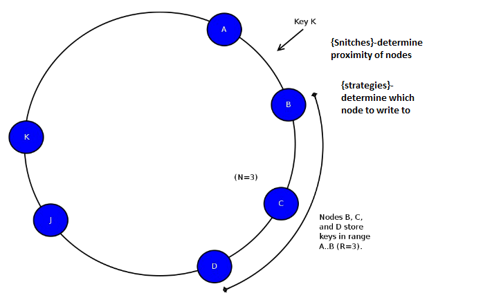

# Breakthrough OLAP
# Performance with
# <span class="cassred">Cassandra</span> and Spark

### Evan Chan
### September 2015

---

## Who am I?

<center>

</center>

- Distinguished Engineer, [Tuplejump](http://www.tuplejump.com)
- @evanfchan
- [`http://velvia.github.io`](http://velvia.github.io)
- User and contributor to Spark since 0.9, Cassandra since 0.6
- Co-creator and maintainer of [Spark Job Server](http://github.com/spark-jobserver/spark-jobserver)

---

## About Tuplejump

[Tuplejump](http://tuplejump.com) is a big data technology leader providing solutions and development partnership.

* [Calliope](http://tuplejump.github.io/calliope/) - the first Spark-Cassandra integration
* [Stargate](http://tuplejump.github.io/stargate/) - an open source Lucene indexer for Cassandra
* [SnackFS](https://github.com/tuplejump/snackfs) - open source HDFS for Cassandra

---

## TupleJump as your Development Partner


---

## Didn't I attend the same talk last year?

- Similar title, but mostly new material
- Will reveal new open source projects!  :)

---

## Problem Space

- Need analytical database / queries on structured big data
    + Something SQL-like, very flexible and fast
    + Pre-aggregation too limiting
- Fast data / constant updates
    + Ideally, want my queries to run over fresh data too

--

## Example: Video analytics

- Typical collection and analysis of consumer events
- 3 billion new events every day
- Video publishers want updated stats, the sooner the better
- Pre-aggregation only enables simple dashboard UIs
- What if one wants to offer more advanced analysis, or a generic data query API?
    + Eg, top countries filtered by device type, OS, browser

NOTE: Too many possible combinations to pre-aggregate

--

## Requirements

- Scalable - rules out PostGreSQL, etc.
- Easy to update and ingest new data
    + Not traditional OLAP cubes - that's not what I'm talking about
- Very fast for analytical queries - OLAP not OLTP
- Extremely flexible queries
- Preferably open source

---

## Parquet

- Widely used, lots of support (Spark, Impala, etc.)
- Problem: Parquet is read-optimized, not easy to use for writes
    + Cannot support idempotent writes
    + Optimized for writing very large chunks, not small updates
    + Not suitable for time series, IoT, etc.
    + Often needs multiple passes of jobs for compaction of small files, deduplication, etc.

&nbsp;
<p>
People really want a database-like abstraction, not a file format!

---

## <span class="cassred">Cassandra</span>

<center>

</center>

- Horizontally scalable
- Very flexible data modelling (lists, sets, custom data types)
- Easy to operate
- Perfect for ingestion of real time / machine data
- Best of breed storage technology, huge community
- **BUT: Simple queries only**
- **OLTP-oriented**

--

## Apache Spark

<center>

</center>

- Horizontally scalable, in-memory queries
- Functional Scala transforms - `map`, `filter`, `groupBy`, `sort` etc.
- SQL, machine learning, streaming, graph, R, many more plugins all on ONE platform - feed your SQL results to a logistic regression, easy!
- Huge number of connectors with every single storage technology

--

## Spark provides the missing fast, deep analytics piece of <span class="cassred">Cassandra</span>!

### ...tying together fast event ingestion and rich deep analytics!

---

## How to make Spark and <span class="cassred">Cassandra</span>
## Go Fast

---

## Spark on <span class="cassred">Cassandra</span>: No Caching

--

## Not Very Fast, but Real-Time Updates

- Spark does no caching by default - you will always be reading from C*!
- Pros:
  + No need to fit all data in memory
  + Always get the latest data
- Cons:
  + Pretty slow for ad hoc analytical queries - using regular CQL tables

--

## How to go Faster?

- Read less data
- Do less I/O
- Make your computations faster

---

## Spark as Cassandra's Cache


--

## Caching a SQL Table from Cassandra

DataFrames support in Cassandra Connector 1.4.0 (and 1.3.0):

<p>
```scala
val sqlContext = new org.apache.spark.sql.SQLContext(sc)

val df = sqlContext.read
                   .format("org.apache.spark.sql.cassandra")
                   .option("table", "gdelt")
                   .option("keyspace", "test").load()
df.registerTempTable("gdelt")
sqlContext.cacheTable("gdelt")
sqlContext.sql("SELECT count(monthyear) FROM gdelt").show()
```

<p>&nbsp;<p>

NOTE: go over it real fast, 30 sec max, just highlight the cacheTable line

--

## How Spark SQL's Table Caching Works


--

## Spark Cached Tables can be Really Fast

GDELT dataset, 4 million rows, 60 columns, localhost

| Method   |  secs       |
| :------- | ----------: |
| Uncached |   317       |
| Cached   |    0.38     |

<p>&nbsp;<p>
Almost a 1000x speedup!
<p>

On an 8-node EC2 c3.XL cluster, 117 million rows, can run common queries 1-2 seconds against cached dataset.

--

## Problems with Cached Tables

- Still have to read the data from Cassandra first, which is slow
- Amount of RAM: your entire data + extra for conversion to cached table
- Cached tables only live in Spark executors - by default
    + tied to single context - not HA
    + once any executor dies, must re-read data from C*
- Caching takes time: convert from RDD[Row] to compressed columnar format
- Cannot easily combine new RDD[Row] with cached tables (and keep speed)

--

## Problems with Cached Tables

If you don't have enough RAM, Spark can cache your tables partly to disk.  This is still way, way, faster than scanning an entire C* table.  However, cached tables are still tied to a single Spark context/application.

Also: `rdd.cache()` is NOT the same as SQLContext's `cacheTable`!

---

## Faster Queries Through Columnar Storage

### Wait, I thought Cassandra was columnar?

--

## How Cassandra stores your CQL Tables

Suppose you had this CQL table:

```sql
CREATE TABLE (
  department text,
  empId text,
  first text,
  last text,
  age int,
  PRIMARY KEY (department, empId)
);
```

--

## How Cassandra stores your CQL Tables

| PartitionKey | 01:first | 01:last | 01:age | 02:first | 02:last | 02:age |
| :----------- | :------- | :------ | -----: | :------- | :------ | -----: |
| Sales        | Bob      | Jones   | 34     | Susan    | O'Connor | 40    |
| Engineering  | Dilbert  | P       | ?      | Dogbert  | Dog     |  1     |

<p>&nbsp;<p>
Each row is stored contiguously.  All columns in row 2 come after row 1.

To analyze only age, C* still has to read every field.

--

Cassandra is really a row-based, OLTP-oriented datastore.

Unless you know how to use it otherwise  :)

NOTE: Cassandra is only columnar in the sense it permits wide rows, or clustering keys, but you'd be hard pressed to know that from looking at CQL table definitions.

---

> The traditional row-based data storage approach is dead<br>
  - Michael Stonebraker

--

## Columnar Storage

**Name column**

| 0     |    1    |
| ----- | ------- |
| 0     |    1    |
<p>&nbsp;<p>
Dictionary: {0: "Barak", 1: "Hillary"}

<p>&nbsp;<p>
**Age column**

| 0     |    1    |
| ----- | ------- |
| 46 | 66 |

NOTE: data from each column is stored together.

--

## Columnar Format solves I/O

How much data can I query interactively?  More than you think!

<center>

</center>

--

## Columnar Storage Performance Study

<center>
http://github.com/velvia/cassandra-gdelt
</center>
&nbsp;

| Scenario       | Ingest   | Read all columns | Read one column |
| :------------- | -------: | ---------------: | --------------: |
| Narrow table   | 1927 sec | 505 sec          | 504 sec         |
| Wide table     | 3897 sec | 365 sec          | 351 sec         |
| Columnar       |  93 sec  |   8.6 sec        | 0.23 sec        |

&nbsp;<p>
On reads, using a columnar format is up to **2190x** faster, while ingestion is 20-40x faster.

--

## Columnar Format solves Caching

- Use the same format on disk, in cache, in memory scan
    + Caching works a lot better when the cached object is the same!!
- No data format dissonance means bringing in new bits of data and combining with existing cached data is seamless

---

## So, why isn't everybody doing this?

- No columnar storage format designed to work with NoSQL stores
- Efficient conversion to/from columnar format a hard problem
- Most infrastructure is still row oriented
    + Spark SQL/DataFrames based on `RDD[Row]`
    + Spark Catalyst is a row-oriented query parser

NOTE: Simply put, it's a lot of work!

---

> All hard work leads to profit, but mere talk leads to poverty.<br>
> - Proverbs 14:23

--


---

## Introducing <span class="golden">FiloDB</span>

<center>
Distributed. Versioned. Columnar. Built for Streaming.
</center>

<p>&nbsp;<p>
<center>
[github.com/tuplejump/FiloDB](http://github.com/tuplejump/FiloDB)
</center>

---

## FiloDB - What?

--

## Distributed

Apache Cassandra.  Scale out with no SPOF.  Cross-datacenter replication.
Proven storage and database technology.

--

## Versioned

Incrementally add a column or a few rows as a new version.  Easily control what versions to query.  Roll back changes inexpensively.

Stream out new versions as continuous queries :)

--

## Columnar

- Parquet-style storage layout
- Retrieve select columns and minimize I/O for analytical queries
- Add a new column without having to copy the whole table
- Vectorization and lazy/zero serialization for extreme efficiency

--

## What's in the name?

<center>

</center>

Rich sweet layers of distributed, versioned database goodness

--

## 100% Reactive

Built completely on the Typesafe Platform:

- Scala 2.10 and SBT
- Spark (including custom data source)
- Akka Actors for rational scale-out concurrency
- Futures for I/O
- Phantom Cassandra client for reactive, type-safe C* I/O
- Typesafe Config

--

## Spark SQL Queries!

```sql
CREATE TEMPORARY TABLE gdelt
USING filodb.spark
OPTIONS (dataset "gdelt");

SELECT Actor1Name, Actor2Name, AvgTone FROM gdelt ORDER BY AvgTone DESC LIMIT 15;
```

- Read to and write from Spark Dataframes
- Append/merge to FiloDB table from Spark Streaming
- Use Tableau or any other JDBC tool

---

## FiloDB - Why?

### Fast Streaming Data + Big Data, All in One!

--

## Analytical Query Performance

### Up to <span class="cassred">200x</span> Faster Queries for Spark on Cassandra 2.x
### Parquet Performance with Cassandra Flexibility

<center>
(Stick around for the demo)
</center>

NOTE: 200x is just based on columnar storage + projection pushdown - no filtering on sort or partition keys, and no caching done yet.

--

## Fast Event/Time-Series Ad-Hoc Analytics


<!-- .element: class="mermaid" -->

- New rows appended via Kafka
- Writes are *idempotent* - no need to dedup!
- Converted to columnar chunks on ingest and stored in C*
- Only necessary columnar chunks are read into Spark for minimal I/O

--

## Fast Event/Time-Series Ad-Hoc Analytics

| Entity  | Time1 | Time2 |
| ------- | ----- | ----- |
| US-0123 | d1    | d2    |
| NZ-9495 | d1    | d2    |

&nbsp;<p>
Model your time series with FiloDB similarly to Cassandra:

- **Sort key**: Timestamp, similar to clustering key
- **Partition Key**: Event/machine entity

FiloDB keeps data sorted while stored in efficient columnar storage.

--

## <span class="golden">FiloDB</span> = Streaming + Columnar

--

## Extend your Cassandra (2.x) Investment

<center>

</center>

Make it work for batch and ad-hoc analytics!

NOTE: You've poured months in learning how to operate C* clusters.  Make that investment pay off for more than just real-time event ingestion!  

--

## Simplify your Lambda Architecture...

<center>

</center>

(https://www.mapr.com/developercentral/lambda-architecture)

--

## With Spark, Cassandra, and FiloDB


<!-- .element: class="mermaid" -->

- Ma, where did all the components go?
- You mean I don't have to deal with Hadoop?
- Use Cassandra as a front end to store IoT data first

--

## FiloDB vs Parquet

* Comparable read performance - with lots of space to improve
  - Assuming co-located Spark and Cassandra
  - Competitive performance for different queries incld joins
  - FiloDB has more room to grow - due to hot column caching and much less deserialization overhead, plus much more filtering flexibility
* Lower memory requirement due to much smaller block sizes
* Much better fit for IoT / Machine / Time-series applications
  - Idempotent writes by PK with no deduplication
* Limited support for types
  - array / set / map support not there, but will be added

---

## FiloDB - How?

--

## Multiple ways to Accelerate Queries

* Columnar projection - read fewer columns, saves I/O
* Partition key filtering - read less data
* Sort key / PK filtering - read from subset of keys
  - Possible because FiloDB keeps data sorted
* Versioning - write to multiple versions, read from the one you choose

--

## FiloDB Architecture

<center>

</center>

--

## Ingestion and Storage?

Current version:

* Each dataset is stored using 2 regular Cassandra tables
* Ingestion using Spark (Dataframes or SQL)

Future version?

* Automatic ingestion of your existing C* data using custom secondary index

---

## Towards Extreme Query Performance

--

## The filo project

[http://github.com/velvia/filo](http://github.com/velvia/filo) is a binary data vector library designed for extreme read performance with minimal deserialization costs.

- Designed for NoSQL, not a file format
- random or linear access
- on or off heap
- missing value support
- Scala only, but cross-platform support possible

--

## What is the ceiling?

This Scala loop can read integers from a binary Filo blob at a rate of **2 billion integers** per second - single threaded:

```scala
  def sumAllInts(): Int = {
    var total = 0
    for { i <- 0 until numValues optimized } {
      total += sc(i)
    }
    total
  }
```

--

## Vectorization of Spark Queries

The [Tungsten](https://databricks.com/blog/2015/04/28/project-tungsten-bringing-spark-closer-to-bare-metal.html) project.

Process many elements from the same column at once, keep data in L1/L2 cache.

Coming in Spark 1.4 through 1.6

--

## Hot Column Caching in Tachyon

- Has a "table" feature, originally designed for Shark
- Keep hot columnar chunks in shared off-heap memory for fast access

---

## FiloDB - Roadmap

* Support for many more data types and sort and partition keys - please give us your input!
* Non-Spark ingestion API.  Your input is again needed.
* In-memory caching for significant query speedup
* Projections.  Often-repeated queries can be sped up significantly with projections.
* Use of GPU and SIMD instructions to speed up queries

--

## You can help!

- Send me your use cases for fast big data analysis on Spark and Cassandra
    + Especially IoT, Event, Time-Series
    + What is your data model?
- Email if you want to contribute

---

## Thanks...

<center>
to the entire OSS community, but in particular:
</center>

- Lee Mighdoll, Nest/Google
- Rohit Rai and Satya B., Tuplejump
- My colleagues at Socrata

<p>&nbsp;</p>
> If you want to go fast, go alone.  If you want to go far, go together.<br>
  -- African proverb

---

# DEMO TIME

### GDELT: Regular C* Tables vs FiloDB

---

# Extra Slides

--

## The scenarios

- [Global Database of Events, Language, and Tone](http://gdeltproject.org) dataset
    + 1979 to now
- 60 columns, 250 million+ rows, 250GB+
- Let's compare Cassandra I/O only, no caching or Spark

1. Narrow table - CQL table with one row per partition key
2. Wide table - wide rows with 10,000 logical rows per partition key
3. Columnar layout - 1000 rows per columnar chunk, wide rows, with dictionary compression

First 4 million rows, localhost, SSD, C* 2.0.9, LZ4 compression.  Compaction performed before read benchmarks.

--

## Disk space usage

| Scenario       | Disk used |
| :------------- | --------: |
| Narrow table   | 2.7 GB   |
| Wide table     | 1.6 GB   |
| Columnar       | 0.34 GB  |

The disk space usage helps explain some of the numbers.

---

## Connecting Spark to Cassandra

- Datastax's [Spark Cassandra Connector](https://github.com/datastax/spark-cassandra-connector)
- Tuplejump [Calliope](http://tuplejump.github.io/calliope/)

<p>&nbsp;
<center>
Get started in one line with `spark-shell`!
</center>

```bash
bin/spark-shell \
  --packages com.datastax.spark:spark-cassandra-connector_2.10:1.4.0-M3 \
  --conf spark.cassandra.connection.host=127.0.0.1
```

---

## What about C* Secondary Indexing?

Spark-Cassandra Connector and Calliope can both reduce I/O by using Cassandra secondary indices.  Does this work with caching?

No, not really, because only the filtered rows would be cached.  Subsequent queries against this limited cached table would not give you expected results.

NOTE: the DataFrames support in connector 1.3.0-M1 doesn't seem to support predicate pushdown.

---

## Turns out this has been solved before!

<center>


</center>

Even [Facebook uses Vertica](http://www.vertica.com/?s=mpp+database).

--

## MPP Databases

<center>

</center>

- Easy writes plus fast queries, with constant transfers
- Automatic query optimization by storing intermediate query projections
- Stonebraker, et. al. - [CStore](https://cs.brown.edu/courses/cs227/archives/2008/mitchpapers/required4.pdf) paper (Brown Univ)

--

> When in doubt, use brute force<br>
> - Ken Thompson

Note: Both traditional RDBMS and OLAP are very expensive to scale, take longer and longer to produce something complex.  What if we took a different approach?

