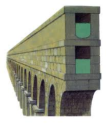
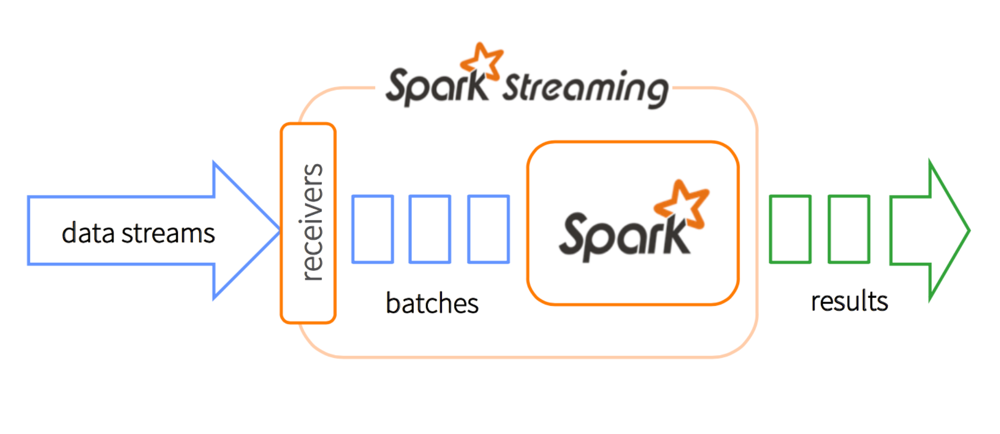
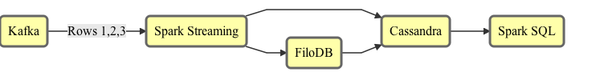
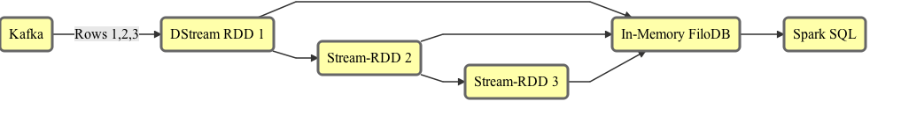
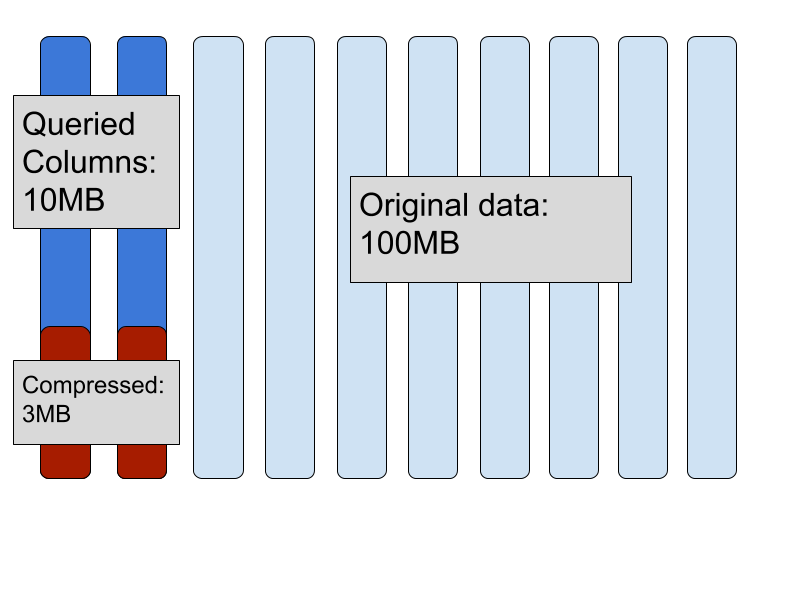

# <span class="golden">FiloDB</span>: Combining
# <span class="georgia-peach">Spark</span> Streaming and
# Fast Ad-Hoc Analytics

### Evan Chan
### November 2015

---

## Who am I?

<center>

</center>

- Distinguished Engineer, [Tuplejump](http://www.tuplejump.com)
- @evanfchan
- [`http://velvia.github.io`](http://velvia.github.io)
- User and contributor to Spark since 0.9, Cassandra since 0.6
- Co-creator and maintainer of [Spark Job Server](http://github.com/spark-jobserver/spark-jobserver)

---

## About Tuplejump

[Tuplejump](http://tuplejump.com) is a big data technology leader providing solutions and development partnership.

* [FiloDB](http://github.com/tuplejump/FiloDB) - subject of today's talk
* [Calliope](http://tuplejump.github.io/calliope/) - the first Spark-Cassandra integration
* [Stargate](http://tuplejump.github.io/stargate/) - an open source Lucene indexer for Cassandra
* [SnackFS](https://github.com/tuplejump/snackfs) - open source HDFS for Cassandra

---

## Tuplejump as your Development Partner


---

<center>

</center>

---

### Big data is yesterday.
# FAST DATA
## is now.

---

<center>

</center>

---

## Fast Data

- Reactive processing of data as it comes in to derive instant insights.
- Is this enough?
- Usually need to combine with existing big data, historical processing, ad hoc.

---

## Let's Talk Architecture!

<center>
  
</center>

---

## Lambda Architecture...

<center>

</center>

(https://www.mapr.com/developercentral/lambda-architecture)

--

## Lambda is Hard

- Real-time pipeline backed by KV store for updates 
- Many moving parts - KV store, real time, batch
  + Lots of monitoring, operations, headache
- Running similar code in two places
- Still ingesting data to Parquet/HDFS 
- Reconcile queries against two different places

--

## NoLambda

<center>YES to:</center>

- A unified system 
- Real-time processing and reprocessing
- Code changes 
- Fault tolerance

---

## SMACK

- Scala/Spark Streaming
- Mesos
- Akka
- Cassandra
- Kafka

--

## Spark Streaming

<center>

</center>

"What's New In Spark Streaming" - Tathagada Das, Strata NY 2015

--

## <span class="cassred">Cassandra</span>

<center>

</center>

- Horizontally scalable
- Very flexible data modelling (lists, sets, custom data types)
- Easy to operate
- Perfect for ingestion of real time / machine data
- Best of breed storage technology, huge community
- **BUT: Simple queries only**
- **OLTP-oriented**

--

## Ad-Hoc and ML with Spark

DataFrames support in Spark Cassandra Connector:

<p>
```scala
val sqlContext = new org.apache.spark.sql.SQLContext(sc)

val df = sqlContext.read
                   .format("org.apache.spark.sql.cassandra")
                   .option("table", "gdelt")
                   .option("keyspace", "test").load()
df.registerTempTable("gdelt")
sqlContext.cacheTable("gdelt")
sqlContext.sql("SELECT count(monthyear) FROM gdelt").show()
```

--

## Spark provides the missing fast, deep analytics piece of <span class="cassred">Cassandra</span>!

### ...tying together fast event ingestion and rich deep analytics!

--

## So What Are We Missing?

| We got    | We're missing   |
|-----------|-----------------|
| Stream processing |         |
| KV storage        |  ??     |
| Analysis (Spark)  |         |

--

## So What Are We Missing?

| We got    | We're missing   |
|-----------|-----------------|
| Stream processing | *Reasonably* fast ad-hoc   |
| KV storage        | ML and advanced analytics  |
| Analysis (Spark)  |     |

&nbsp;<p>
Ad hoc analysis of Cassandra data is VERY slow.  100-300x slower than Parquet.

---

## What about Parquet?

- Good for static data
- Problem: Parquet is read-optimized, not easy to use for writes
    + Cannot support idempotent writes
    + Optimized for writing very large chunks, not small updates
    + Not suitable for time series, IoT, etc.
    + Often needs multiple passes of jobs for compaction of small files, deduplication, etc.

&nbsp;
<p>
People really want a database-like abstraction, not a file format!

---

## One Pipeline For Fast + Big Data


<!-- .element: class="mermaid" -->

Now, how do I make the SMACK stack work for ML, Ad-Hoc + Fast Data?

How do I combine Spark Streaming + Ad Hoc and have good performance?

---

> All hard work leads to profit, but mere talk leads to poverty.<br>
> - Proverbs 14:23

---

## Introducing <span class="golden">FiloDB</span>

<center>
A distributed, versioned, columnar analytics database. Built for Streaming.
</center>

<p>&nbsp;<p>
<center>
[github.com/tuplejump/FiloDB](http://github.com/tuplejump/FiloDB)
</center>

---

## <span class="golden">FiloDB</span> - What?

--

## Distributed

Apache Cassandra as the rock-solid storage engine.  Scale out with no SPOF.  Cross-datacenter replication.
Proven storage and database technology.

--

## Versioned

Incrementally add a column or a few rows as a new version.  Easily control what versions to query.  Roll back changes inexpensively.

Stream out new versions as continuous queries :)

--

## Columnar

- Parquet-style storage layout
- Retrieve select columns and minimize I/O for analytical queries
- Add a new column without having to copy the whole table
- Vectorization and lazy/zero serialization for extreme efficiency

--

## Spark SQL Queries!

```sql
CREATE TEMPORARY TABLE gdelt
USING filodb.spark
OPTIONS (dataset "gdelt");

SELECT Actor1Name, Actor2Name, AvgTone FROM gdelt ORDER BY AvgTone DESC LIMIT 15;
```

- Read to and write from Spark Dataframes
- Append/merge to FiloDB table from Spark Streaming
- Use Tableau or any other JDBC tool

--

## What's in the name?

<center>

</center>

Rich sweet layers of distributed, versioned database goodness

--

## 100% Reactive

Built completely on the Typesafe Platform:

- Scala 2.10 and SBT
- Spark (including custom data source)
- Akka Actors for rational scale-out concurrency
- Futures for I/O
- Phantom Cassandra client for reactive, type-safe C* I/O
- Typesafe Config

---

## <span class="golden">FiloDB</span> - Why?

--

## Analytical Query Performance

### Up to <span class="cassred">200x</span> Faster Queries for Spark on Cassandra 2.x
### Parquet Performance with Cassandra Flexibility
### (with much better performance ceiling in the future)

<center>
(Stick around for the demo)
</center>

NOTE: 200x is just based on columnar storage + projection pushdown - no filtering on sort or partition keys, and no caching done yet.

--

## <span class="golden">FiloDB</span> = Streaming + Columnar

### Fast Streaming Data + Big Data, All in One!

NOTE: Combining streaming input and columnar/analytical storage is an extremely hard problem, that we are solving!

--

## Designed for Streaming

- New rows appended via Spark Streaming or Kafka
- Writes are *idempotent* - easy **exactly once** ingestion
- Converted to columnar chunks on ingest and stored in C*
- FiloDB keeps your data sorted as it is being ingested

--

## SMACK stack for all your Analytics


<!-- .element: class="mermaid" -->

- Write key-value lookups to Cassandra regularly
- Write raw data / events to FiloDB for ad-hoc analysis / ML
- Far smaller stack to maintain for your analytics

--

## Fast Event/Time-Series Ad-Hoc Analytics

| Entity  | Time1 | Time2 |
| ------- | ----- | ----- |
| US-0123 | d1    | d2    |
| NZ-9495 | d1    | d2    |

&nbsp;<p>
Model your time series with FiloDB similarly to Cassandra:

- **Sort key**: Timestamp, similar to clustering key
- **Partition Key**: Event/machine entity

FiloDB keeps data sorted while stored in efficient columnar storage.

---

## No Cassandra? Keep it All In Memory


<!-- .element: class="mermaid" -->

- Unlike RDDs and DataFrames, FiloDB can ingest new data, and still be fast
- Unlike RDDs, FiloDB can filter in multiple ways, no need for entire table scan

--

## FiloDB In-Memory Performance

---

## <span class="golden">FiloDB</span> - How?

--

## Multiple ways to Accelerate Queries

* Columnar projection - read fewer columns, saves I/O
* Partition key filtering - read less data
* Sort key / PK filtering - read from subset of keys
  - Possible because FiloDB keeps data sorted
* Versioning - write to multiple versions, read from the one you choose

--

## Columnar Format solves I/O

How much data can I query interactively?  More than you think!

<center>

</center>

--

## Columnar Storage Performance Study

<center>
http://github.com/velvia/cassandra-gdelt
</center>
&nbsp;

| Scenario       | Ingest   | Read all columns | Read one column |
| :------------- | -------: | ---------------: | --------------: |
| Narrow table   | 1927 sec | 505 sec          | 504 sec         |
| Wide table     | 3897 sec | 365 sec          | 351 sec         |
| Columnar       |  93 sec  |   8.6 sec        | 0.23 sec        |

&nbsp;<p>
On reads, using a columnar format is up to **2190x** faster, while ingestion is 20-40x faster.

--

## Columnar Format solves Caching

- Use the same format on disk, in cache, in memory scan
    + Caching works a lot better when the cached object is the same!!
- No data format dissonance means bringing in new bits of data and combining with existing cached data is seamless

--

## FiloDB Architecture

<center>

</center>

--

## Ingestion and Storage?

Current version:

* Each dataset is stored using 2 regular Cassandra tables
* Ingestion using Spark (Dataframes or SQL)

Future version?

* Automatic ingestion of your existing C* data using custom secondary index

---

## Towards Extreme Query Performance

--

## The filo project

[http://github.com/velvia/filo](http://github.com/velvia/filo) is a binary data vector library designed for extreme read performance with minimal deserialization costs.

- Designed for NoSQL, not a file format
- random or linear access
- on or off heap
- missing value support
- Scala only, but cross-platform support possible

--

## What is the ceiling?

This Scala loop can read integers from a binary Filo blob at a rate of **2 billion integers** per second - single threaded:

```scala
  def sumAllInts(): Int = {
    var total = 0
    for { i <- 0 until numValues optimized } {
      total += sc(i)
    }
    total
  }
```

--

## Vectorization of Spark Queries

The [Tungsten](https://databricks.com/blog/2015/04/28/project-tungsten-bringing-spark-closer-to-bare-metal.html) project.

Process many elements from the same column at once, keep data in L1/L2 cache.

Coming in Spark 1.4 through 1.6

--

## Hot Column Caching in Tachyon

- Has a "table" feature, originally designed for Shark
- Keep hot columnar chunks in shared off-heap memory for fast access

---

## FiloDB - Roadmap

* Support for many more data types and sort and partition keys - please give us your input!
* Non-Spark ingestion API.  Your input is again needed.
* In-memory caching for significant query speedup
* Projections.  Often-repeated queries can be sped up significantly with projections.
* Use of GPU and SIMD instructions to speed up queries

--

## You can help!

- Send me your use cases for fast big data analysis on Spark and Cassandra
    + Especially IoT, Event, Time-Series
    + What is your data model?
- Email if you want to contribute

---

## Thanks...

<center>
to the entire OSS community, but in particular:
</center>

- Lee Mighdoll, Nest/Google
- Rohit Rai and Satya B., Tuplejump
- My colleagues at Socrata

<p>&nbsp;</p>
> If you want to go fast, go alone.  If you want to go far, go together.<br>
  -- African proverb

---

# DEMO TIME

### GDELT: Regular C* Tables vs FiloDB

---

## FiloDB vs Parquet

* Comparable read performance - with lots of space to improve
  - Assuming co-located Spark and Cassandra
  - Competitive performance for different queries incld joins
  - FiloDB has more room to grow - due to hot column caching and much less deserialization overhead, plus much more filtering flexibility
* Lower memory requirement due to much smaller block sizes
* Much better fit for IoT / Machine / Time-series applications
  - Idempotent writes by PK with no deduplication
* Limited support for types
  - array / set / map support not there, but will be added


