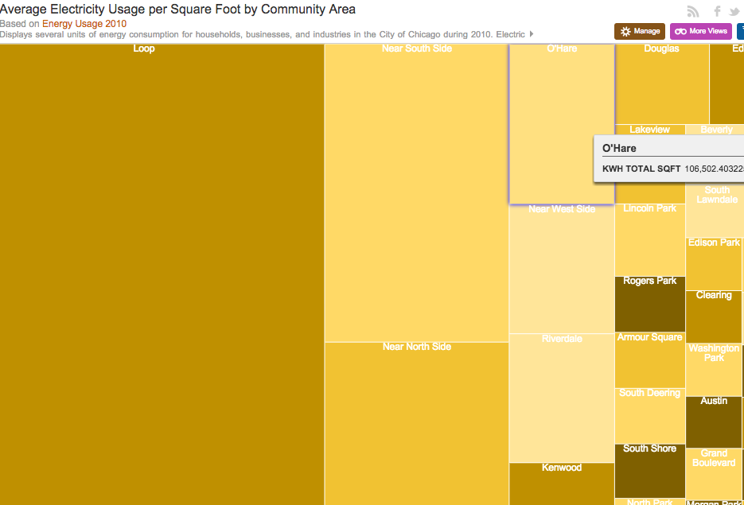
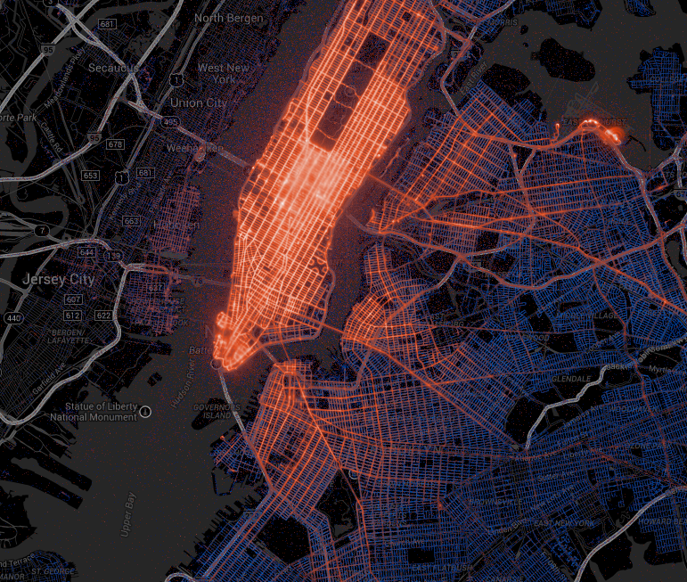
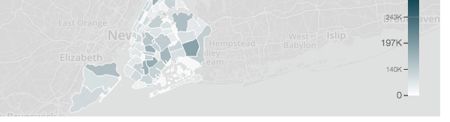
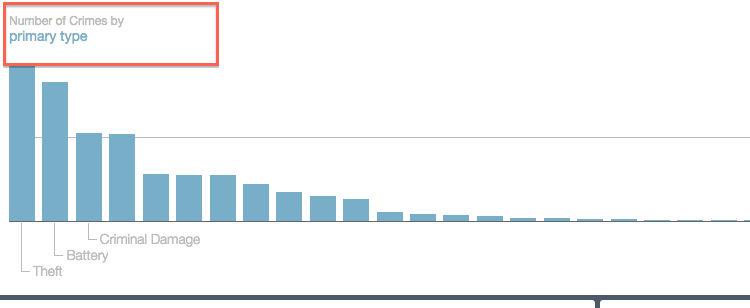
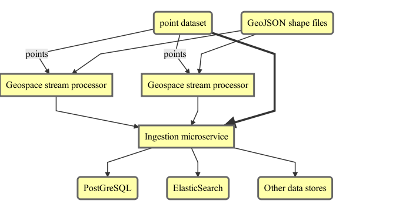
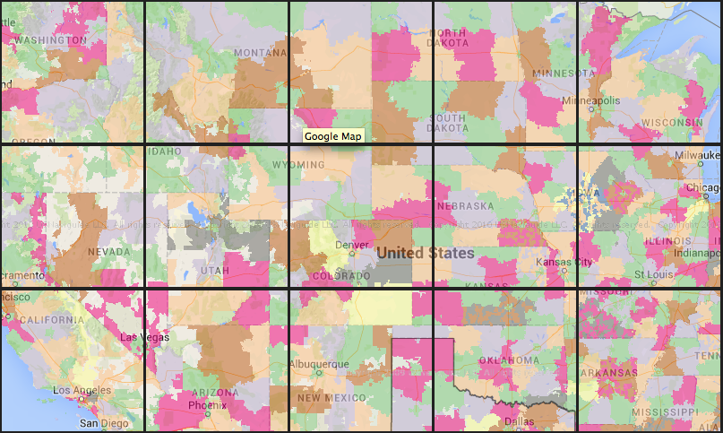
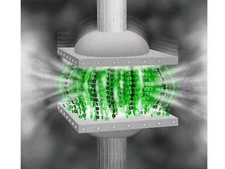
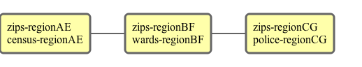

# Efficient Streaming Vector Processing in
# <span class="scalared">Scala</span> at Socrata

### Evan Chan
### Mar 2015

---

## Who am I?

- Principal Engineer, [Socrata, Inc.](http://www.socrata.com)
- @evanfchan
- [`http://github.com/velvia`](http://github.com/velvia)
- Active in multiple OSS projects including Apache Spark

---

## 

<center>
<h3>The leading open <span style="color: #ff5887">data</span> software platform</h3>
</center>

[data.edmonton.ca](http://data.edmonton.ca) [finances.worldbank.org](http://finances.worldbank.org) [data.cityofchicago.org](http://data.cityofchicago.org) [data.seattle.gov](http://data.seattle.gov) [data.oregon.gov](http://data.oregon.gov) [data.wa.gov](http://data.wa.gov) [www.metrochicagodata.org](http://www.metrochicagodata.org) [data.cityofboston.gov](http://data.cityofboston.gov) [info.samhsa.gov](http://info.samhsa.gov) [explore.data.gov](http://explore.data.gov) [data.cms.gov](http://data.cms.gov) [data.ok.gov](http://data.ok.gov) [data.nola.gov](http://data.nola.gov) [data.illinois.gov](http://data.illinois.gov) [data.colorado.gov](http://data.colorado.gov) [data.austintexas.gov](http://data.austintexas.gov) [data.undp.org](http://data.undp.org) [www.opendatanyc.com](http://www.opendatanyc.com) [data.mo.gov](http://data.mo.gov) [data.nfpa.org](http://data.nfpa.org) [data.raleighnc.gov](http://data.raleighnc.gov) [dati.lombardia.it](http://dati.lombardia.it) [data.montgomerycountymd.gov](http://data.montgomerycountymd.gov) [data.cityofnewyork.us](http://data.cityofnewyork.us) [data.acgov.org](http://data.acgov.org) [data.baltimorecity.gov](http://data.baltimorecity.gov) [data.energystar.gov](http://data.energystar.gov) [data.somervillema.gov](http://data.somervillema.gov) [data.maryland.gov](http://data.maryland.gov) [data.taxpayer.net](http://data.taxpayer.net) [bronx.lehman.cuny.edu](http://bronx.lehman.cuny.edu) [data.hawaii.gov](http://data.hawaii.gov) [data.sfgov.org](http://data.sfgov.org)

Note: I'm proud to rep Socrata - we are the open data and open government company. Our mission is to help government inform citizens and provide awesome APIs and visualizations. We organize lots of civic hackathons.

---

## 21st century government

<center>Data-driven government and informed citizens can:</center>

- Lower the cost of healthcare
- Improve education systems
- Fight climate change
- Improve city safety
- Reduce the occurrences of crime
- Reduce bureaucratic inefficiencies
- Spur local innovation

---

## Why Socrata cares about Geo

- 311 and 911 data
- where crimes are occurring
- traffic and transportation information

NOTE: Most of the interesting data that citizens and government care about are highly geographical

--

## Chicago energy usage by community area



--

## New York City taxi patterns



--

## Open Data Visualizations





---

## The geo-region-coding problem

- What customers want: fast interactive choropleths
- Multitenant
- Fast
- Low latency

--

## Region Datasets

- Comes in as Shapefiles
- Static, new versions = new dataset
- Biggest ones contain 100,000's of polygons
- Many municipalities have their own GIS departments -> custom shapefiles

--

## Can this be done on query?

``` sql
select count(*) as count, r.ward, c.primary_type
from crimes_100000 as c
join wards as r
on ST_Contains(r.geom, c.point)
group by r.ward, c.primary_type
order by count desc;
```

Way too slow!  <!-- .element: class="fragment roll-in" -->

--

- would take 103 seconds for a 5.5 million row dataset (PostGres 9.3.4)
- JOIN is only possible if dataset resides in same DB
- we have datasets that are 20 million rows, and growing

<center>

</center>

--

## So what do we do?

- Preprocess!
- Add a new join column for each region we want to graph against
- Slows down when we need to add a new region, but makes queries much faster

---

## Why Streaming?

Standard PostGIS workflow:

- Ingest all the data points
- Create a JOIN table, or insert a column in original table
    + various tradeoffs.... managing multiple join tables ick ick ick
- Latency is too high, need to wait for entire table to be inserted
- We also want to enable alternative datastores easily

--

## New Streaming Use Cases

- Even for small data, streaming gives us much lower latency
- Big data - PostGIS not really an option
- New streaming use cases
    + Vehicle or bus traffic analysis
    + Needs to be up to the minute
- Streaming is data-location-independent

---

## Why Scala?

<center>

</center>

The rise of functional programming due to many-core, distributed systems.

- Immutable data structures make concurrency safe
- Very rich concurrency and distributed programming (Akka actors)
- Functional transformations - map, reduce
- Much more concise and productive than Java

---

## Scala is dominating big data world

- Apache Spark: by far the hottest big data platform, written in Scala
- GeoTrellis
- `map`, `reduce`, `fold`, `sort` transforms small or big data
    + Learn it once, use it in Spark, Scalding, SummingBird, etc.
- Take advantage of Java Geospatial ecosystem
    + JTS, GeoTools, GeoServer, etc.

---

## Scala at Socrata

Socrata has been a 100% Scala shop in our backend services for 2-3 years, started using Scala 2.8 a loooong time ago....

---

## Geo region coding architecture


<!-- .element: class="mermaid" -->

The geospace microservice also ingests shapefiles.

---

## Geospace server stack

A microservice for geo-region-coding 

- Scala 2.10
- [Scalatra](http://www.scalatra.org)
- JTS
- GeoTools / [Geoscript.scala](https://github.com/dwins/geoscript.scala)
- Service registration and discovery using [socrata-http](http://github.com/socrata/socrata-http)

---

## JTS

- Basic geometry types (Point, Line, Polygon, etc.)
- Geometry ops (intersection, contains, etc.)
- Some simplication algorithms
- RTree implementations for spatial indexing
- WKB and WKT reader/writers

---

## GeoTools

- Shapefile reading and writing
- FeatureCollections filtering/iteration, GeoJSON
- JDBC and database connectors
- CRS and projections
- Extensions for WMS, gridding, many others

NOTE: GeoTools is more of a higher level GIS toolkit.

---

## Geo-region-coding in detail

1. Request comes in for coding points against a certain set of shapes
2. Load shapes from data backend if needed
    - GeoJSON parsing
    - reprojection if needed to WGS84
    - store envelopes of shapes into `STRTree`
3. For each point, find matching envelopes in spatial index
4. Search through geometries using intersects/covers

---

```scala
 /**
   * Returns a list of Entry's which contain the given geometry, as defined by JTS contains test.
   * Uses the spatial index to minimize the number of items to search.
   *
   * @param geom the Geometry which the indexed geometries should contain
   * @return a Seq of entries containing geom.
   */
  def whatContains(geom: Geometry): Seq[Entry[T]] = {
    val results = index.query(geom.getEnvelopeInternal).asScala.asInstanceOf[Seq[Entry[T]]]
    results.filter { entry => entry.prep.covers(geom) }
  }
```

---

## How the current version stacks up

- Multitenancy
    + Uses an in-memory cache and Futures for efficient geo operations
- Fast
    + 10,000+ point in polygon ops/sec per thread
    + Only when region is in memory though - loading could take many seconds
- Low latency
    + Not when run low on memory or loading region shapes

---

## Memory Pressure

- Regularly monitoring memory usage
    + `Runtime.getRuntime.freeMemory`
    + Watch out! `maxMemory` is the currently allocated max, not -Xmx!
    + Actively evict from cache when low on memory
- Eviction: bad bad bad!! (latency goes out the window)

---

## More Efficiency?  But How?

- Use bigger machines!
- Sharding
- Less coordinates
    + Simplification
    + Partitioning
- More efficient coordinates
- Off-heap memory

---

## Use bigger machines!

Pros:
- Less memory pressure => better latency
- EASY!

Cons:
- Doesn't really scale
- Doesn't fundamentally solve any issues

---

## Sharding!

| Geospace 1  |  Geospace 2  |
| :---------- | :----------- |
| US zipcodes | Chicago wards |
| Census blocks | New York boroughs |

- Direct points to instance based on region dataset to code against
- Easy to implement, scales (kind of)
- "Hot spot" of large region datasets
    + Huge variation of region dataset sizes - 1000's to millions of coordinates

---

## Partitioning



---

## Partitioning

| Geospace 1  |  Geospace 2  |
| :---------- | :----------- |
| zips-regionAE | zips-regionBF |
| chicagoWards-AE | census-BF |

- Most of our point datasets are heavily localized
- Helps both loading regions into memory and reduce memory pressure
- Much more fine grained and even distribution/sharding

---

## Partitioning: How?

- Partition all the region datasets using the same hashing scheme
    + Implies common projection for everything - should be doing this anyways
- GeoHash - ASCII encoding of latitude/longitude
    + Each letter subdivides the space into 4 x 8 grid
    + Used in ElasticSearch, MongoDB, etc.
- Space-filling curve

---

## Efficient Geometries

<center>

</center>

Compression - trading absolute speed for more storage?

---

### The JTS `Coordinate` object takes 40 bytes for storing two doubles!

---

## Store compact geometries

- Store as WKB, decompress and cache on demand
- Or, use `PackedCoordinateSequence` for compact representation that expands on demand

```scala
  val transformer = new GeometryTransformer {
    override def transformCoordinates(coordSeq: CoordinateSequence,
                                      parent: Geometry): CoordinateSequence = {
      new PackedCoordinateSequence.Double(coordSeq.toCoordinateArray)
    }
  }
```

---

## Results

- 60% less memory usage minimum, but 40% more if every shape is read and used
- Just as fast as normal Geometry, on average.
- Soft reference for `Coordinate[]` means expanded representation is released under memory pressure
- If you don't cache:
    + Memory stays at 60% less
    + You take a 37% slowdown in intersection/covers due to deserialization

---

## Use PreparedGeometry

`PreparedGeometryFactory.prepare(geom)`

- Uses very little extra memory
- 10x speedup!!
- Combine with `PackedCoordinateSequence` for memory efficiency plus speed!

---

## BTW: Implementing custom CoordinateSequences

Not that hard:  https://gist.github.com/velvia/69ca1ab5e758d3b0ab13

- For example, for small polygons, use delta encoding to store not doubles, but floats or ints

---

## Spark Roadmap


<!-- .element: class="mermaid" -->

1. Create an RDD of Points with a custom partitioning by geo region
2. Geo-region-code

If points are not partitioned evenly, perhaps partition by hash of (geo-region and other bucket).

---

## Future Work and Enhancements

- Geo vector processing in Spark
- Streaming GeoJSON parser
- Collaboration with LocationTech folks
    + GeoMesa and Cassandra
    + Geotrellis
- Higher performance geometry representations

---

## Open Source

http://www.github.com/socrata/tile-server

http://www.github.com/socrata/geospace

[Socrata GeoJSON parser](https://github.com/socrata/socrata-thirdparty-utils/blob/master/core/src/main/scala/com/socrata/thirdparty/geojson/GeoJson.scala)

---

# Thank you!

### Socrata is hiring!  Come talk to me about cool geospatial / big data / public data work.

---

## The Ultimate Combo

- Use the more efficient JTS `CoordinateSequence` APIs to extract ordinate values (x, y) instead of always relying on `Coordinate[]`
- Store as a packed double array or packed floating point delta array
- Binary representation that doesn't require deserialization

