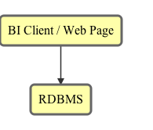
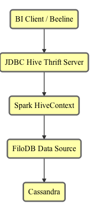
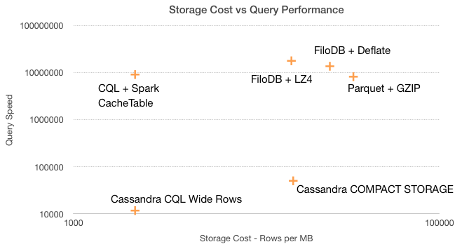
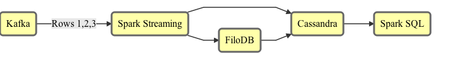
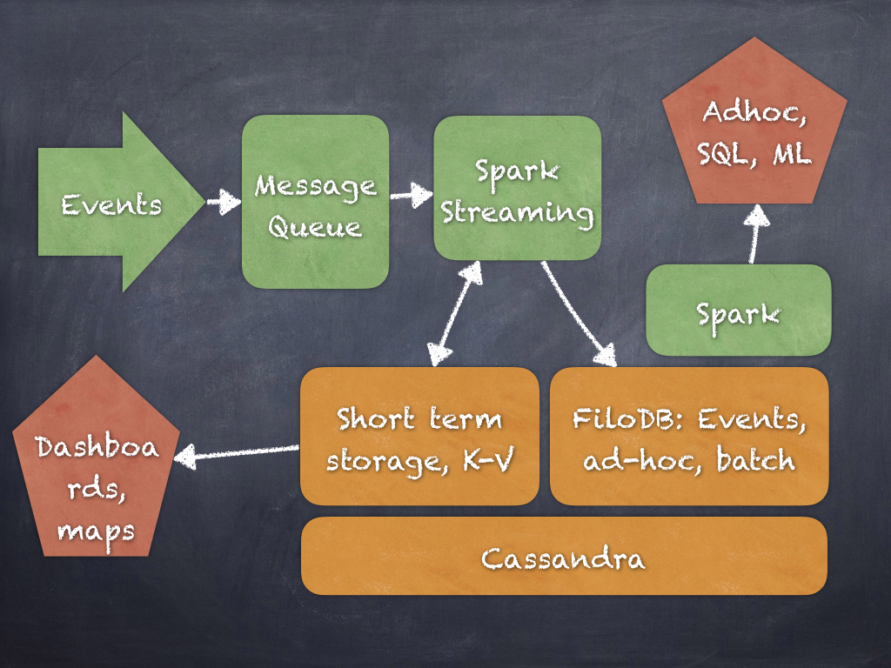

# 700 *Updatable* Queries Per Second:
# Spark as a Real-Time Web Service

### Evan Chan
### June 2016

---

## Apache Spark

Usually used for rich analytics, not time-critical.

- Machine learning: generating models, predictions, etc.
- SQL Queries seconds to minutes, low concurrency
- Stream processing

What about for low-latency, highly concurrent queries?  Dashboards?

---

## Low-Latency Web Queries

Why is it important?

- Dashboards
- Interactive analytics
- Real-time data processing

Why not use the Spark stack for this?

---

## Web Query Stack


<!-- .element: class="mermaid" -->

---

## Spark-based Low-Latency Stack


<!-- .element: class="mermaid" -->

---

## Creating a new SparkContext is S-L-O-W

- Start up HTTP/BitTorrent File Server
- Start up UI
- Start up executor processes and wait for confirmation

The bigger the cluster, the slower!

---

## Using a Persistent Context for
## Low-Latency

- Avoid high overhead of Spark application launch
- Standard pattern:
    - [Spark Job Server](http://github.com/spark-jobserver/spark-jobserver)
    - Hive Thrift Server
- Accept queries and run them in context
- cache relations

---

## FAIR Scheduling

- FIFO vs FAIR Scheduling
    + FAIR scheduler can co-schedule concurrent Spark jobs even if they take up lots of resources
    + Higher concurrency
    + FIFO allows concurrency if tasks do not use up all threads
- In Mesos, use coarse-grained mode to avoid launching executors on every Spark task

---

## Low-Latency Game Plan

- Start a persistent Spark Context (or use the Hive ThriftServer - we’ll get to that below)
- Run it in FAIR scheduler mode
- Use fast in-memory storage
- Maximize concurrency by using as few partitions/threads as possible
- Host the data and run it on a single node - avoid expensive network shuffles

---

## In-Memory Storage

- Is it really faster than on disk files?  With OS Caching?
    + It's about *consistency* of performance - not just hot data in the page cache, but ALL data.
    + Fast random access
- Making different tradeoffs as new memory technologies emerge (NVRAM etc.)
    + Higher IO -> less need for compression
    + Apache Arrow

---

## So, let's talk Spark Storage in Detail

---

## HDFS?  Parquet Files?

- Column pruning speeds up I/O significantly
- Still have to scan lots of files
- File organization not the easiest for filtering
- For low-latency, need much more fine-grained indexing

---

## Cached RDDs

Let's say you have an RDD[T], where each item is of type T.

- Bytes are saved on JVM heap, or optionally heap + disk
- Spark optionally serializes it, using by default Java serialization, so it (hopefully) takes up less space
- Pros: easy (`myRdd.cache()`)
- Cons: have to iterate over every item, no column pruning, slow if need to deserialize, memory hungry, cannot update

---

## Cached DataFrames

Works on a DataFrame (`RDD[Row]` with a schema).  (`sqlContext.cacheTable(tableA)`)

- Uses columnar storage for very efficient storage
- Columnar pruning for faster querying
- Pros: easy, efficient memory footprint
- Cons: no filtering, cannot update

---

## Why are updates important?

- Appends
    + Streaming workloads.  Need to constantly add new data
    + Real data is *always* changing.   Queries on live real-time data has business benefits.
- Updates
    + Idempotency = really simple ingestion pipelines
    + No need for expensive deduplication in your streaming layer - the layer that should be the *simplest*!

---

## Advantages of Filtering

- Two methods to lower query latency:
    + Scan data faster (in-memory)
    + Scan less data (filtering)
- RDDs and cached DFs - prune by partition
- Dynamo/BigTable - 2D Filtering
    + Filter by partition
    + Filter within partitions

---

## Workarounds - updating RDDs

- Union(oldRDD, newRDD)
- Creates a tree of RDDs - slows down queries significantly
- IndexedRDD

---

## Introducing <span class="golden">FiloDB</span>

<center>
A distributed, versioned, columnar analytics database.<br>
*Built for Streaming.*
</center>

<p>&nbsp;<p>
<center>
[github.com/tuplejump/FiloDB](http://github.com/tuplejump/FiloDB)
</center>

--

## Fast Analytics Storage

- Scan speeds competitive with Apache Parquet
  + Up to 200x faster scan speeds than with Cassandra 2.x
- Flexible filtering along two dimensions
  + Much more efficient and flexible partition key filtering
- Efficient columnar storage, up to 40x more efficient than Cassandra 2.x

NOTE: 200x is just based on columnar storage + projection pushdown - no filtering on sort or partition keys, and no caching done yet.

--

## Comparing Storage Costs and Query Speeds

<center>

</center>

<center>
[https://www.oreilly.com/ideas/apache-cassandra-for-analytics-a-performance-and-storage-analysis](https://www.oreilly.com/ideas/apache-cassandra-for-analytics-a-performance-and-storage-analysis)
</center>

--

## Robust Distributed Storage

Apache Cassandra as the rock-solid storage engine.  Scale out with no SPOF.  Cross-datacenter replication.
Proven storage and database technology.

--

## Cassandra-Like Data Model

<table>
  <tr>
    <td></td>
    <td colspan="2">Column A</td>
    <td colspan="2">Column B</td>
  </tr>
  <tr>
    <td>Partition key 1</td>
    <td>Segment 1</td>
    <td>Segment 2</td>
    <td>Segment 1</td>
    <td>Segment 2</td>
  </tr>
  <tr>
    <td>Partition key 2</td>
    <td>Segment 1</td>
    <td>Segment 2</td>
    <td>Segment 1</td>
    <td>Segment 2</td>
  </tr>
</table>
&nbsp;<p>

- **partition keys** - distributes data around a cluster, and allows for fine grained and flexible filtering
- **segment keys** - do range scans within a partition, e.g. by time slice
- primary key based ingestion and updates

--

## Predicate Pushdown Filtering

The more you can filter, the faster your query!

* Column pruning - SELECT a, b, c
* Partition key pushdowns
  - VERY FAST: single or multiple partition reads: =, IN on all partition keys
  - FAST: =, IN on some partition keys
* segment key ranges:  =, >= a AND <= b

--

## Spark SQL Queries!

```sql
CREATE TABLE gdelt USING filodb.spark OPTIONS (dataset "gdelt");

SELECT Actor1Name, Actor2Name, AvgTone FROM gdelt ORDER BY AvgTone DESC LIMIT 15;

INSERT INTO gdelt SELECT * FROM NewMonthData;
```

- Read to and write from Spark Dataframes
- Append/merge to FiloDB table from Spark Streaming
- Use Tableau or any other JDBC tool

--

## What's in the name?

<center>

</center>

Rich sweet layers of distributed, versioned database goodness

--

## SNACK (SMACK) stack for
## all your Analytics


<!-- .element: class="mermaid" -->

- Regular Cassandra tables for highly concurrent, aggregate / key-value lookups (dashboards)
- FiloDB + C* + Spark for efficient long term event storage
  - Ad hoc / SQL / BI
  - Data source for MLLib / building models
  - Data storage for classified / predicted / scored data

--



--

## Being Productionized as we speak...

- One enterprise with many TB of financial and reporting data is moving their data warehouse to FiloDB + Cassandra + Spark
- Another startup uses FiloDB as event storage, feeds the events into Spark MLlib, scores incoming data, then stores the results back in FiloDB for low-latency use cases
  + From their CTO: “I see close to MemSQL / Vertica or even better”  “More cost effective than Redshift”

---

## Fast SQL Query Server in Spark

The code and instructions for running benchmarks can be viewed [here](https://github.com/tuplejump/FiloDB/tree/feature/automated-stress-testing/stress).

---

## CollectAsync

To support running concurrent queries better, we rely on a relatively unknown feature of Spark's RDD API, `collectAync`:

    sqlContext.sql(queryString).rdd.collectAsync

This returns a Scala `Future`, which can easily be composed using `Future.sequence` to launch a whole series of asynchronous RDD operations.  They will be executed with the help of a separate ForkJoin thread pool.  

---

## Modeling example: NYC Taxi Dataset

The public [NYC Taxi Dataset](http://www.andresmh.com/nyctaxitrips/) contains telemetry (pickup, dropoff locations, times) info on millions of taxi rides in NYC.

| Medallion prefix  | 1/1 - 1/6   |  1/7 - 1/12  |
| ----------------- | ----------- | ------------ |
| AA             | records     |  records     |
| AB             | records     |  records     |

* Partition key - `:stringPrefix medallion 2` - hash multiple drivers trips into ~300 partitions
* Segment key - `:timeslice pickup_datetime 6d`
* Row key - hack_license, pickup_datetime

Allows for easy filtering by individual drivers, and slicing by time.

---

## Initial Results

- Run lots of queries concurrently using `collectAsync`
- Spark `local[*]` mode
- SQL queries on first million rows of NYC Taxi dataset
- 50 Queries per Second
- Most of time not running queries but parsing SQL !

---

Some observations.

1. Starting up a Spark task is actually pretty low latency - milliseconds
2. One huge benefit to filtering is reduced thread/CPU usage.  Most of the queries ended up being single partition / single thread.  

---

Lessons

1. Cache the SQL to DataFrame/LogicalPlan parsing.  This saves ~20ms per parse, which is not insignificant for low-latency apps
2. Distribute the SQL parsing away from the main thread so it's not gated by one thread

---

## SQL Plan Caching

```scala
  val cachedDF = new collection.mutable.HashMap[String, DataFrame]

  def getCachedDF(query: String): DataFrame =
    cachedDF.getOrElseUpdate(query, sql.sql(query))
```

Cache the `DataFrame` containing the logical plan translated from parsing SQL.

Now - **700 QPS**!!

---

## Scaling With More Data

15 million rows of NYC Taxi data - **still 700 QPS**!

This makes sense due to the efficiency of querying.

---

## Fast Spark Query Stack

- Front end app -> App with embedded Spark/FiloDB
    + Run Spark context on heap with `local[*]`
    + Load FiloDB-Spark connector, load data in memory
    + Very fast queries all in process
- JS UI -> Spark Job Server (REST) -> Local Spark/FiloDB
    + Same idea as above
- BI Client -> Hive Thrift Server -> Spark/FiloDB
    + Higher latency

---

## What's Next

Things left to do for FiloDB:

- Robustify in-memory column store, make it work distributed
- Add a custom caching SQL context so caching code is not needed?
- Add support for Tachyon / Alluxio for distributed local cache

---

# THANK YOU!

We are hiring!
