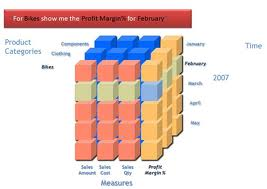
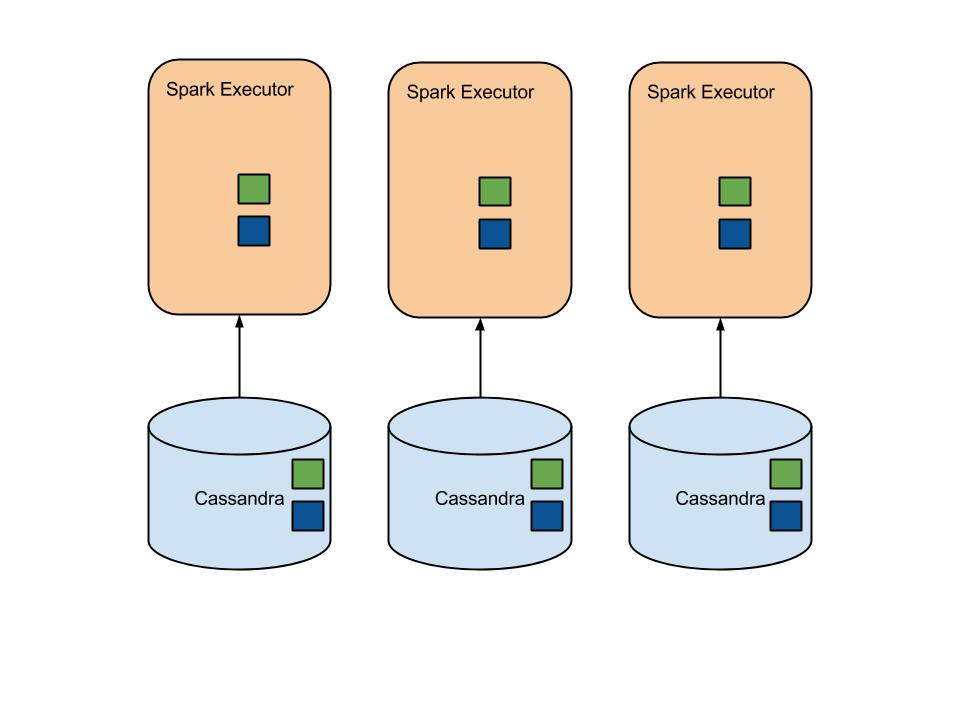
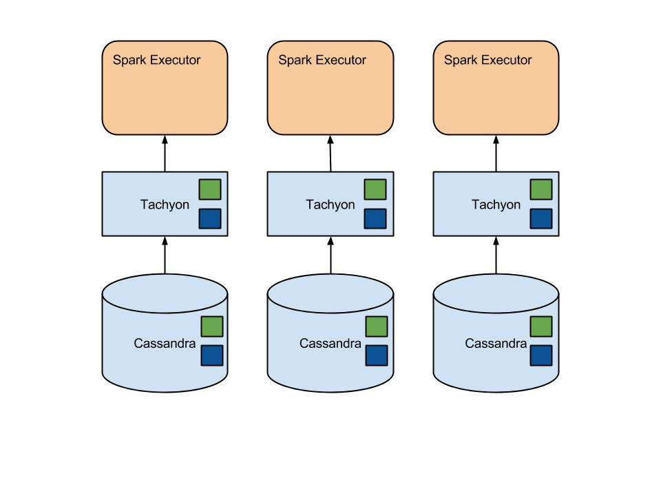

# OLAP with Spark and Cassandra

### Evan Chan
### July 2014

---

## Who am I?

- Principal Engineer, [Socrata, Inc.](http://www.socrata.com)
- @evanfchan
- [`http://github.com/velvia`](http://github.com/velvia)
- Creator of [Spark Job Server](http://github.com/ooyala/spark-jobserver)

--

## 

<center>
<h3>We build <span style="color: #4e82ff">software</span> to make <span style="color: #ff5887">data</span> useful to <span style="color: #f7b63d">more people</span>.</h3>
</center>

[data.edmonton.ca](http://data.edmonton.ca) [finances.worldbank.org](http://finances.worldbank.org) [data.cityofchicago.org](http://data.cityofchicago.org) [data.seattle.gov](http://data.seattle.gov) [data.oregon.gov](http://data.oregon.gov) [data.wa.gov](http://data.wa.gov) [www.metrochicagodata.org](http://www.metrochicagodata.org) [data.cityofboston.gov](http://data.cityofboston.gov) [info.samhsa.gov](http://info.samhsa.gov) [explore.data.gov](http://explore.data.gov) [data.cms.gov](http://data.cms.gov) [data.ok.gov](http://data.ok.gov) [data.nola.gov](http://data.nola.gov) [data.illinois.gov](http://data.illinois.gov) [data.colorado.gov](http://data.colorado.gov) [data.austintexas.gov](http://data.austintexas.gov) [data.undp.org](http://data.undp.org) [www.opendatanyc.com](http://www.opendatanyc.com) [data.mo.gov](http://data.mo.gov) [data.nfpa.org](http://data.nfpa.org) [data.raleighnc.gov](http://data.raleighnc.gov) [dati.lombardia.it](http://dati.lombardia.it) [data.montgomerycountymd.gov](http://data.montgomerycountymd.gov) [data.cityofnewyork.us](http://data.cityofnewyork.us) [data.acgov.org](http://data.acgov.org) [data.baltimorecity.gov](http://data.baltimorecity.gov) [data.energystar.gov](http://data.energystar.gov) [data.somervillema.gov](http://data.somervillema.gov) [data.maryland.gov](http://data.maryland.gov) [data.taxpayer.net](http://data.taxpayer.net) [bronx.lehman.cuny.edu](http://bronx.lehman.cuny.edu) [data.hawaii.gov](http://data.hawaii.gov) [data.sfgov.org](http://data.sfgov.org) [data.cityofmadison.com](http://data.cityofmadison.com) [healthmeasures.aspe.hhs.gov](http://healthmeasures.aspe.hhs.gov) [data.weatherfordtx.gov](http://data.weatherfordtx.gov) [www.data.act.gov.au](http://www.data.act.gov.au) [data.wellingtonfl.gov](http://data.wellingtonfl.gov) [data.honolulu.gov](http://data.honolulu.gov) [data.kcmo.org](http://data.kcmo.org) [data2020.abtassociates.com](http://data2020.abtassociates.com)

Note: We lead the open data and open government movements and organize lots of civic hackathons


---

## We are Swimming in Data!

---

### Big Data at Ooyala

* **2.5 billion** analytics pings a day = almost a **trillion** events a year.
* Roll up tables - 30 million rows per day

--

### Big Data at Socrata

* Hundreds of datasets, each one up to 30 million rows
* Customer demand for billion row datasets

---

## How can we allow customers to query a year's worth of data?

- Flexible - complex queries included
  + Sometimes you can't denormalize your data enough
- Fast - interactive speeds

---

## RDBMS?  PostGres?

* Start hitting latency limits at ~10 million rows
* No robust and inexpensive solution for querying across shards
* No robust way to scale horizontally
* Complex and expensive to improve performance (eg rollup tables)

---

<center>

</center>

## OLAP Cubes?

- Materialize summary for every possible combination
- Too complicated and brittle
- Takes forever to compute
- Explodes storage and memory

---

> When in doubt, use brute force<br>
> - Ken Thompson

Note: Both traditional RDBMS and OLAP are very complex approaches and expensive to scale.  What if we took a different approach?

---

 <!-- .element: class="stretch" -->
     <!-- .element: class="fragment roll-in" -->

--

## Cassandra

- Horizontally scalable
- Very flexible data modelling (lists, sets, custom data types)
- Easy to operate
- No fear of number of rows or documents
- Best of breed storage technology, huge community
- **BUT: Simple queries only**


--

## Apache Spark

- Horizontally scalable, in-memory queries
- Functional Scala transforms - `map`, `filter`, `groupBy`, `sort` etc.
- SQL, machine learning, streaming, graph, R, many more plugins all on ONE platform - feed your SQL results to a logistic regression, easy!
- THE Hottest big data platform, huge community, leaving Hadoop in the dust
- Developers love it

--

## Spark provides the missing fast, deep analytics piece of Cassandra!

---

## Integrating Spark and Cassandra

Scala solutions:

- Datastax integration: [`https://github.com/datastax/cassandra-driver-spark`](https://github.com/datastax/cassandra-driver-spark)  (CQL-based)
- [Calliope](http://tuplejump.github.io/calliope/)

--

A bit more work:

* Use traditional Cassandra client with RDDs
* Use an existing InputFormat, like CqlPagedInputFormat

--

## Example Custom Integration using Astyanax

```scala
  val cassRDD = sc.parallelize(rowkeys).
                   flatMap { rowkey =>
                     columnFamily.get(rowkey).execute().asScala
                   }
```

---

## A Spark and Cassandra
## OLAP Architecture

---

## Separate Storage and Query Layers

- Combine best of breed storage and query platforms
- Take full advantage of evolution of each
- Storage handles replication for availability
- Query can replicate data for scaling read concurrency - *independent!*

---

## Scale Nodes, not
## Developer Time!!

Note: Spark doesn't have to be as efficient as PostGres on each node for this to succeed.

---

## Keeping it simple

- Maximize row scan speed
- Columnar representation for efficiency
- Compressed bitmap indexes for fast algebra
- Functional transforms for easy memoization, testing, concurrency, composition

---

## Spark as Cassandra's Cache



--

### Even better: Tachyon Off-Heap Caching



---

## Initial Attempts

```scala
val rows = Seq(
        Seq("Burglary", "19xx Hurston", 10),
        Seq("Theft", "55xx Floatilla Ave", 5)
    )

sc.parallelize(rows)
  .map { values => (values[0], values) }
  .groupByKey
  .reduce(_[2] + _[2])
```

--

- No existing generic query engine for Spark when we started (Shark was in infancy, had no indexes, etc.), so we built our own
- For every row, need to extract out needed columns
- Ability to select arbitrary columns means using `Seq[Any]`, no type safety
- Boxing makes integer aggregation very expensive and memory inefficient

---

## Columnar Storage and Querying

---

> The traditional row-based data storage approach is dead<br>
  - Michael Stonebraker

---

## Traditional Row-Based Storage

Same layout in memory and on disk:
<p>&nbsp;<p>

| Name    |  Age  |
| :------ | ----: |
| Barak   |    46 |
| Hillary |    66 |

<p>&nbsp;<p>
Each row is stored contiguously.  All columns in row 2 come after row 1.

--

## Columnar Storage (Memory)

**Name column**

| 0     |    1    |
| ----- | ------- |
| 0     |    1    |
<p>&nbsp;<p>
Dictionary: {0: "Barak", 1: "Hillary"}

<p>&nbsp;<p>
**Age column**

| 0     |    1    |
| ----- | ------- |
| 46 | 66 |

--

## Columnar Storage (Cassandra)

Review: each physical row in Cassandra (e.g. a "partition key") stores its columns together on disk.

<p>&nbsp;<p>
Schema CF

| Rowkey    |  Type  |
| :-------- | :----- |
| Name      |  StringDict |
| Age       |  Int   |

<p>&nbsp;<p>
Data CF

| Rowkey    |  0 |  1 |
| :-------- | -- | -- |
| Name      | 0  |  1 |
| Age       | 46 | 66 |

---

## Advantages of Columnar Storage

- Compression
    + Dictionary compression - HUGE savings for low-cardinality string columns
    + RLE
- Reduce I/O
    + Only columns needed for query are loaded from disk
- Can keep strong types in memory, avoid boxing
- Batch multiple rows in one cell for efficiency

---

## Advantages of Columnar Querying

- Cache locality for aggregating column of data
- Take advantage of CPU/GPU vector instructions for ints / doubles
- avoid row-ifying until last possible moment
- easy to derive computed columns
- Use vector data / linear math libraries

---

## Columnar query engine vs row-based in Scala

- Custom RDD of column-oriented blocks of data
- Uses **~10x** less heap
- **10-100x** faster for group by's on a single node
- Scan speed in excess of 150M rows/sec/core for integer aggregations

---

## So, Great, OLAP with Cassandra and Spark.  Now What?

---


---

## Datastax: Cassandra Spark Integration

- Datastax Enterprise now comes with HA Spark
  + HA master, that is.
- [cassandra-driver-spark](https://github.com/datastax/cassandra-driver-spark)

---

## Spark SQL

- Appeared with Spark 1.0
- In-memory columnar store
- Can read from Parquet now;  Cassandra integration coming
- Querying is not column-based (yet)
- No indexes
- Write custom functions in Scala ....  take that Hive UDFs!!
- Integrates well with MLBase, Scala/Java/Python

---

## Work Still Needed

- Indexes
- Columnar querying for fast aggregation
- Efficient reading from columnar storage formats

---

## Getting to a Billion Rows / Sec

- Benchmarked at 20 million rows/sec, GROUP BY on two columns, aggregating two more columns.  Per core.
- 50 cores needed for parallel localized grouping throughput of 1 billion rows
- ~5-10 additional cores budget for distributed exchange and grouping of locally agggregated groups, depending on result size and network topology

- Above is a custom solution, NOT Spark SQL.
- Look for integration with Spark/SQL for a proper solution

---

## Lessons

- Extremely fast distributed querying for these use cases
    + Data doesn't change much (and only bulk changes)
    - Analytical queries for subset of columns
    - Focused on numerical aggregations
    - Small numbers of group bys, limited network interchange of data
* Spark a bit rough around edges, but evolving fast
* Concurrent queries is a frontier with Spark.  Use additional Spark contexts.

---

# THANK YOU!

---

# Some Columnar Alternatives

- Monetdb and Infobright - true columnar stores (storage + querying)
- Cstore-fdw for PostGres - columnar storage only
- Vertica and C-Store
- Google BigQuery - columnar cloud database, Dremel based
- Amazon RedShift
