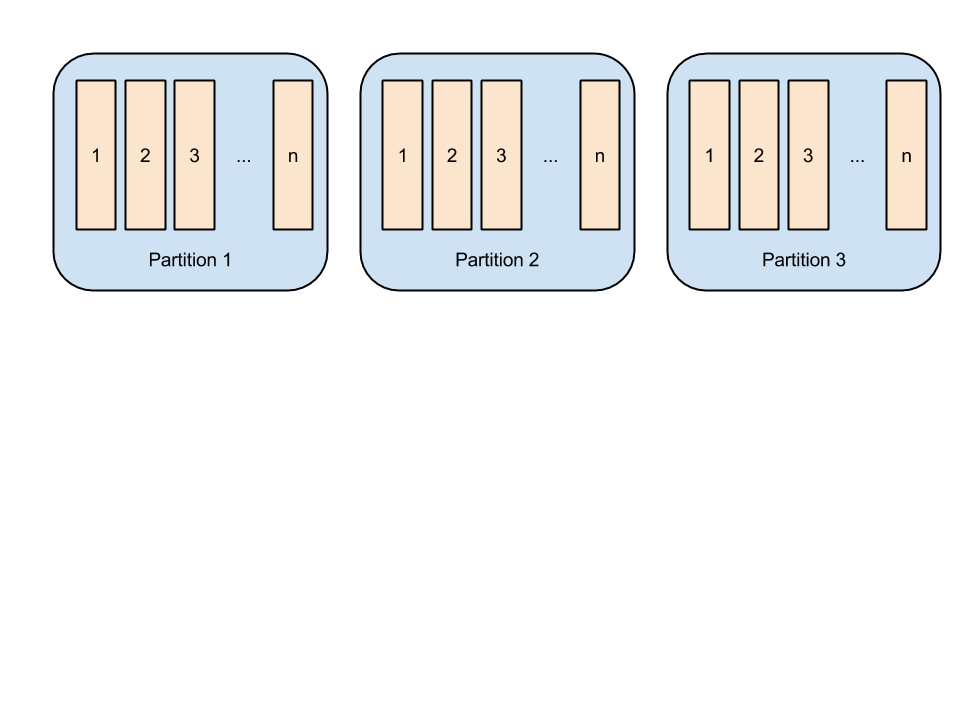
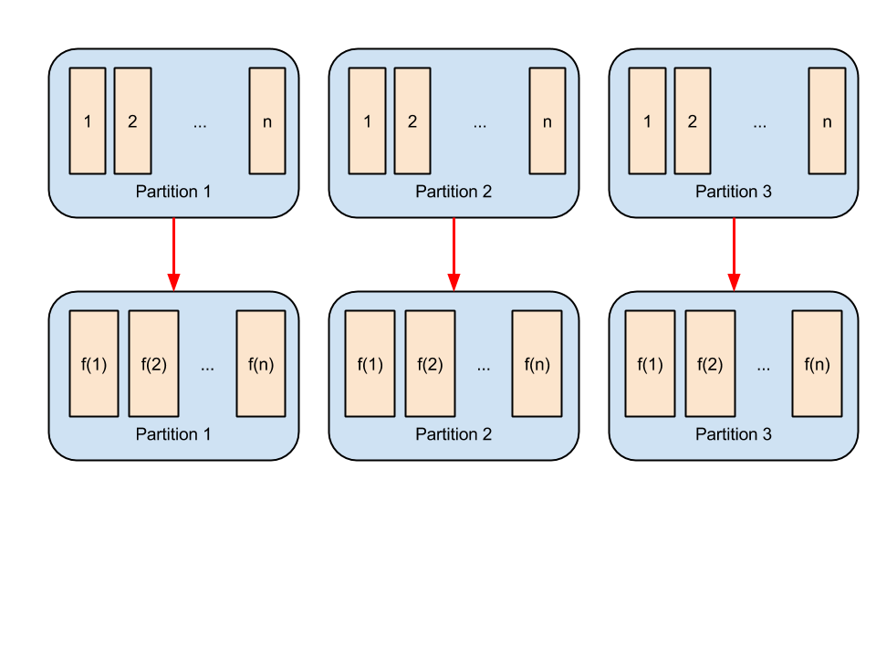
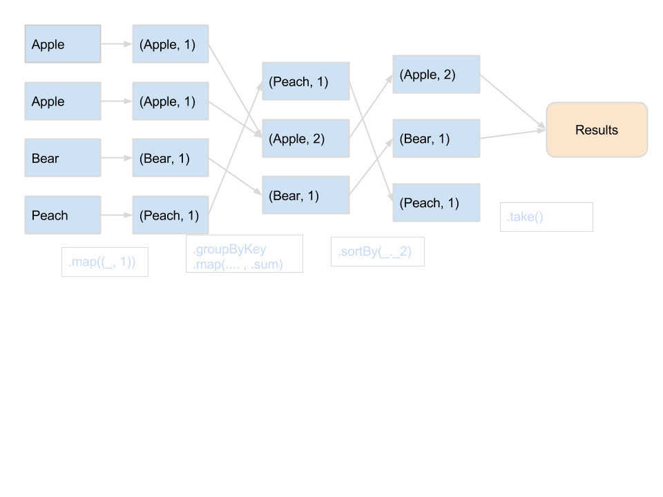

# From <span class="scalared">Scala</span> Collections
# to Fast Big Data with
# <span class="georgia-peach">Apache Spark</span>

### Evan Chan
### Nov 2014

---

## Who am I?

- Principal Engineer, [Socrata, Inc.](http://www.socrata.com)
- @evanfchan
- [`http://github.com/velvia`](http://github.com/velvia)
- Creator of [Spark Job Server](http://github.com/spark-jobserver/spark-jobserver)

---

## 

<center>
<h3>We build <span style="color: #4e82ff">software</span> to make <span style="color: #ff5887">data</span> useful to <span style="color: #f7b63d">more people</span>.</h3>
</center>

[data.edmonton.ca](http://data.edmonton.ca) [finances.worldbank.org](http://finances.worldbank.org) [data.cityofchicago.org](http://data.cityofchicago.org) [data.seattle.gov](http://data.seattle.gov) [data.oregon.gov](http://data.oregon.gov) [data.wa.gov](http://data.wa.gov) [www.metrochicagodata.org](http://www.metrochicagodata.org) [data.cityofboston.gov](http://data.cityofboston.gov) [info.samhsa.gov](http://info.samhsa.gov) [explore.data.gov](http://explore.data.gov) [data.cms.gov](http://data.cms.gov) [data.ok.gov](http://data.ok.gov) [data.nola.gov](http://data.nola.gov) [data.illinois.gov](http://data.illinois.gov) [data.colorado.gov](http://data.colorado.gov) [data.austintexas.gov](http://data.austintexas.gov) [data.undp.org](http://data.undp.org) [www.opendatanyc.com](http://www.opendatanyc.com) [data.mo.gov](http://data.mo.gov) [data.nfpa.org](http://data.nfpa.org) [data.raleighnc.gov](http://data.raleighnc.gov) [dati.lombardia.it](http://dati.lombardia.it) [data.montgomerycountymd.gov](http://data.montgomerycountymd.gov) [data.cityofnewyork.us](http://data.cityofnewyork.us) [data.acgov.org](http://data.acgov.org) [data.baltimorecity.gov](http://data.baltimorecity.gov) [data.energystar.gov](http://data.energystar.gov) [data.somervillema.gov](http://data.somervillema.gov) [data.maryland.gov](http://data.maryland.gov) [data.taxpayer.net](http://data.taxpayer.net) [bronx.lehman.cuny.edu](http://bronx.lehman.cuny.edu) [data.hawaii.gov](http://data.hawaii.gov) [data.sfgov.org](http://data.sfgov.org) [data.cityofmadison.com](http://data.cityofmadison.com) [healthmeasures.aspe.hhs.gov](http://healthmeasures.aspe.hhs.gov) [data.weatherfordtx.gov](http://data.weatherfordtx.gov) [www.data.act.gov.au](http://www.data.act.gov.au) [data.wellingtonfl.gov](http://data.wellingtonfl.gov) [data.honolulu.gov](http://data.honolulu.gov) [data.kcmo.org](http://data.kcmo.org) [data2020.abtassociates.com](http://data2020.abtassociates.com)

Note: We are the open data and open government company. We organize lots of civic hackathons.  We publish government data to make it easy for you to be an informed citizen.   Oh, and our entire backend is in Scala!!
True story, last year I was sitting in your seat, had never heard of Socrata, a speaker came up and talked about how they were changing the world, and I said, I'm in!!

---

<center>

</center>

<p>
<center>
Why do we love Scala so much?
</center>

&nbsp;
<p>
<center>
Concurrency?   <!-- .element: class="fragment roll-in" -->

Java interop?  <!-- .element: class="fragment roll-in" -->

FP?            <!-- .element: class="fragment roll-in" -->

**Collections...**  <!-- .element: class="fragment roll-in" -->
</center>

Note: You don't understand how awesome Scala's collections are until compared with other languages.  Immutable collections, very very rich functionality.... 

---

## Why functional collections are so *awesome*

- Makes working with data a joy
- Easily go from sequential, to parallel, to distributed Hadoop/Spark computations
- Many other monads are based on collections as well!
    + `Option`
    + `Try`

Note: and when you say Scala is a Scalable language, this is the proof in the pudding!

---

## map

```scala
scala> List(1, 3, 5, 6, 7).map(_ * 2)
res0: List[Int] = List(2, 6, 10, 12, 14)
```

---

## How `map` really works

```scala
  def map[B, That](f: A => B)(implicit bf: CanBuildFrom[Repr, B, That]): That = {
    def builder = { // extracted to keep method size under 35 bytes, so that it can be JIT-inlined
      val b = bf(repr)
      b.sizeHint(this)
      b
    }
    val b = builder
    for (x <- this) b += f(x)
    b.result
  }
```

- A new collection is created using `CanBuildFrom`
- Elements are added one at a time by evaluating the mapping function

---

## Must it be sequential?

- Well, it doesn't.

```scala
scala> List(1, 3, 5, 6, 7).par.map(_ * 2)
res1: scala.collection.parallel.immutable.ParSeq[Int] = ParVector(2, 6, 10, 12, 14)
```

> Parallel operations are implemented with divide and conquer style algorithms that parallelize well. The basic idea is to split the collection into smaller parts until they are small enough to be operated on sequentially.

---

<center>
 
</center>

Note: Speaking of divide and conquer.... this is not a concept we invented... insects are incredibly good at it!

---

## What else can be easily parallelized?

- `filter`
- `foreach`
- Harder: `groupBy`

---

## Intro to Apache 

- Horizontally scalable, in-memory queries
- Concise functional Scala API (+ Java, Python, R, etc.)
- SQL, machine learning, streaming, graph, R
- Huge community and momentum
    + Integration with Hadoop, S3, most datastores
- REPL for easy interactive data analysis

Note: Spark is leaving Hadoop in the dust, much like Scala vs Java.  REPL much easier than writing Hadoop MR jobs for development.  I could go on and on and on, but since this is a Scala conference and not a big data conference, let's get on with some code shall we?

---

## Doing a distributed `map` with Spark

```scala
  myIntRdd.map(_ * 2).take(100)
```

Map and filter Petabytes of data.  Same scala syntax!!

What is really going on under the hood?

---

## RDD - Resilient Distributed Dataset

- Core data abstraction in Spark
- Distributed immutable collection of items
- Each partition must fit entirely on one node



---

## An RDD is typed like a Scala collection

- Scala: `Seq[Int]`
- Spark: `RDD[Int]`
- Functions that read line input, like `sc.textFile()` return `RDD[String]`

---

## Under the hood - `rdd.map()`

<center>
    
</center>

---

## Under the hood - `rdd.take()`

- Spark Worker nodes are where computations are run and data is cached
- Spark *driver* controls the program flow and executes steps like `map`, `take`
- In this case `take` returns the first n items from the worker nodes to the driver
- Map function and captured variables must be serializable over the network

---

## Overview of Spark APIs

Within RDD Transformations:
```scala
> map, filter, groupBy, sample
```

Cross RDD Transformations:
```scala
> join, cartesian, coGroup
```

RDD Actions:
```scala
> reduce, count, collect, take, foreach
```

RDD Optimization / Misc:
```scala
> coalesce, repartition, pipe
```

---

## Laziness

<center>
    
</center>

NOTE: Not the Homer kind of lazy, but lazy collections!

---

## Eager vs lazy collections

`myList.map()` returns a new collection immediately.  What about `Stream`s and `Iterator`s?

```scala
scala> List(1, 2, 3, 4, 5).toStream
res1: scala.collection.immutable.Stream[Int] = Stream(1, ?)
```

<p>
```scala    
scala> res1.map(_ * 2)
res2: scala.collection.immutable.Stream[Int] = Stream(2, ?)
```
<!-- .element: class="fragment roll-in" -->

It's lazy -- computation is not done until you ask for results:
<!-- .element: class="fragment roll-in" -->

```scala
scala> res2.take(3).toList
res5: List[Int] = List(2, 4, 6)
```
<!-- .element: class="fragment roll-in" -->

Note: even the `take(3)` is not enough to produce immediate results.

---

## How laziness is achieved

```scala
  override final def map[B, That](f: A => B)(implicit bf: CanBuildFrom[Stream[A], B, That]): That = {
    if (isStreamBuilder(bf)) asThat(
      if (isEmpty) Stream.Empty
      else cons(f(head), asStream[B](tail map f))
    )
    else super.map(f)(bf)
  }
```

- We only evaluate the mapping function f on the first element, then return a `Stream` of the tail elements mapped using f
- Key to laziness is that the tail is not evaluated
- New stream has `map f` as part of its state

---

## Streams vs Iterators

- Both `Stream` and `Iterator` are lazy
- `Stream`s memoize their results - watch memory usage
- `Iterator`s are mutable and can only be used once. `Stream`s are immutable and reusable.
    + Compare `Stream.from(0).take(2).toList` to `Iterator.from(0).take(2).toList`
- `Stream`s are easy to define functionally using the `#::` operator

---

## Spark and laziness

---

## Spark and laziness

```scala
> sparkContext.parallelize((1 to 10)).map( x => x*i)
res6: org.apache.spark.rdd.RDD[Int] = MappedRDD[2] at map at <console>:33
```

- How come Spark doesn't produce the mapped result immediately?  Ohhh... Spark is *lazy*...
- Notice the `MappedRDD` ... Spark remembers each transformation as a wrapper RDD

---

## Spark RDD actions

To get a series of RDD transformations to actually execute, we need an RDD action function:

```scala
> res6.count
res8: Long = 10
```

```scala
> res6.collect
res9: Array[Int] = Array(2, 4, 6, 8, 10, 12, 14, 16, 18, 20)
```

`count` is a popular way to "force" computation in Spark.

---

## Why laziness is important for Spark

- Do as little work as possible - huge difference for big data
    + eg. `take(n)` only requires computing the first n items
- Less memory for intermediate results
- Spark can optimize execution plan when all the transformations are known
    + eg., multiple map and filter steps can be executed in the same phase
- History of transformations -- the *lineage* - is used for error recovery and resiliency

---

## Caching data in Spark

- `.cache()` causes Spark to save results of last transformation in worker's heap memory
- Without cache, full list of transformations has to be run, including reading from input source
- Like memoization
- 1-2 orders of magnitude speedup
- Iterative processing on cached results - eg for linear regression - is a big part of Spark's speedup over Hadoop

---

## Types of caching

|  Type                   |                                  |
| :---------------------- | -------------------------------- |
| In worker node JVM heap | `MEMORY_ONLY`, `MEMORY_ONLY_SER` |
| JVM heap and disk       | `MEMORY_AND_DISK`, `MEMORY_AND_DISK_SER`, `DISK_ONLY` |
| Replicated              | `MEMORY_ONLY_2`, `MEMORY_AND_DISK_2` |
| Tachyon / off-heap      | `OFF_HEAP` - resilient to worker crashes |
| Spark SQL caching       | efficient columnar compressed in memory cache |
<!-- .element: class="fullwidth" -->

---

## More fun - grouping and sorting

---

## TopK word count in Scala

```scala
scala> val words = Seq("Apple", "Bear", "Country", "Tahoe", "dork", "p", "e", "Apple", "Bear", "p", "Bear")
words: Seq[String] = List(Apple, Bear, Country, Tahoe, dork, p, e, Apple, Bear, p, Bear)
```
```scala
scala> words.groupBy(x => x).
     |       map { case (word, words) => (word, words.length) }.
     |       toSeq.
     |       sortBy(_._2).
     |       reverse.
     |       take(5)
res3: Seq[(String, Int)] = ArrayBuffer((Bear,3), (p,2), (Apple,2), (Tahoe,1), (dork,1))
```

Note: Hopefully not a mystery to anyone.  Go over line by line?
This is a pretty powerful and succinct operation - would have probably taken a page of Java code.  Unless you're using Java 8.

---

## TopK in Spark - method 1

```scala
val words = sparkContext.parallelize(Seq("Apple", "Bear", "Country", "Tahoe", "dork", "p", "e", "Apple", "Bear", "p", "Bear"))
words: org.apache.spark.rdd.RDD[String] = ParallelCollectionRDD[0] at parallelize at <console>:29
```
```scala
> words.map((_, 1)).groupByKey.
|       map { case (word, counts) => (word, counts.sum) }.
|       sortBy(_._2, false).
|       take(5)
res16: Array[(String, Int)] = Array((Bear,3), (p,2), (Apple,2), (Tahoe,1), (dork,1))
```

groupByKey: `("Apple", 1), ("Apple", 1)` -> `("Apple" -> Seq(1, 1))`

Note: map outputs an RDD[(String, Int)].  groupByKey turns that into an RDD of (String, Seq[Int]).

---

## What's actually happening



---

## What's actually happening

- All the transformations (blue boxes) happen on cluster worker nodes
- Chain of computations doesn't start until the `take` which causes top n sorted results to be delivered to the driver
- There are two network shuffles - once during `groupByKey` and once during `sortBy`.

---

## TopK in Spark - method 2

Could we do any better?  Why yes.

```scala
> words.map((_, 1)).reduceByKey(_ + _).
|       map { case (word, count) => (count, word) }.
|       top(5)
res1: Array[(Int, String)] = Array((3,Bear), (2,p), (2,Apple), (1,e), (1,dork))
```

`top` avoids the global sort by taking the top items from each node, then merging them at the driver.

- This works only if there are no duplicate items across nodes
- `reduceByKey` = `groupByKey` + `reduce`

---

## ETL

---

## ETL, single threaded

Chicago Crimes data, extract a few fields, filter by date

```scala
scala> io.Source.fromFile("/tmp/crimes4000.csv").
     |    getLines.
     |    map(_.split(",")).
     |    map(a => (a(0), a(2), a(5), a(6))).
     |    filter(_._2 contains "2014").
     |    take(20)
res13: Iterator[(String, String, String, String)] = non-empty iterator
```

What if you have a huge file?
<!-- .element: class="fragment roll-in" -->

---

## Parallel ETL

Break the file into multiple chunks:

```scala
scala> (1 to 4).par.flatMap(n => io.Source.fromFile(s"/tmp/crimes${n}.csv").getLines).
     |    map(_.split(",")).
     |    map(a => (a(0), a(2), a(5), a(6))).
     |    filter(_._2 contains "2014").
     |    take(20)
res15: scala.collection.parallel.immutable.ParSeq[(String, String, String, String)] = ParVector((9600927,05/06/2014 05:00:00 AM,BURGLARY,FORCIBLE ENTRY), (9599537,05/06/2014 04:58:00 AM,CRIMINAL DAMAGE,TO PROPERTY), (9599803,05/06/2014 04:45:00 AM,BATTERY,SIMPLE), (9599796,05/06/2014 04:43:00 AM,THEFT,OVER $500), (9599696,05/06/2014 04:42:00 AM,THEFT,OVER $500), (9599556,05/06/2014 04:29:00 AM,BURGLARY,UNLAWFUL ENTRY), (9599557,05/06/2014 04:20:00 AM,MOTOR VEHICLE THEFT,AUTOMOBILE), (9599687,05/06/2014 04:00:00 AM,MOTOR VEHICLE THEFT,AUTOMOBILE), (9599511,05/06/2014 03:49:00 AM,CRIMINAL TRESPASS,TO VEHICLE), (9599983,05/06/2014 03:17:00 AM,CRIMINAL DAMAGE,TO PROPERTY), (9599544,05/06/2014 03:10:00 AM,THEFT,$500 AND UNDER), (9600915,05/06/2014 03:00:00 AM,BATTERY,DOMESTIC BATTERY SIMPLE), (95998...
```

...and run it in parallel.

---

## What if my data is many GBs?

---

## Parallel ETL in Spark

Load your data into HDFS / S3 / storage, then:

```scala
scala> context.textFile("/tmp/*.csv").
     |    map(_.split(",")).
     |    map(a => (a(0), a(2), a(5), a(6))).
     |    filter(_._2 contains "2014").
     |    take(20)
res20: Array[(String, String, String, String)] = Array((9600927,05/06/2014 05:00:00 AM,BURGLARY,FORCIBLE ENTRY), (9599537,05/06/2014 04:58:00 AM,CRIMINAL DAMAGE,TO PROPERTY),
```

Code is virtually the same!!

---

## Side effects

Writing output to a datastore:

```scala
myRdd.foreach { data => myDB.write(data) }
```

---

## Spark Streaming


<!-- .element: class="lightimgback" -->

---

## Streaming word count

```scala
// Create a DStream that will connect to hostname:port, like localhost:9999
val lines = ssc.socketTextStream("localhost", 9999)

// Split each line into words
val words = lines.flatMap(_.split(" "))

// Count each word in each batch
val pairs = words.map(word => (word, 1))
val wordCounts = pairs.reduceByKey(_ + _)
```

- Almost exact same code as batch word count
- Horizontally scalable stream processing

---

## Spark tips

- Use the REPL!  Excellent way to start, learn, explore.
- Remember the laziness.  Know when to use actions vs transformations.
- Limit the number of expensive grouping / sorting operations.
- Explore the many subcomponents: Spark Streaming, MLLib, GraphX, Spark SQL
- Understand caching
- Check out the many integrations to make your lives easier: Spark-ElasticSearch, spark-cassandra-connector, etc. etc.

---

## Conclusion

<center>
If you can <span class="scalared">flatMap</span> it, then you can <span class="georgia-peach">Spark</span> it!
<br>
Go [try it](http://spark-project.org) today!
</center>